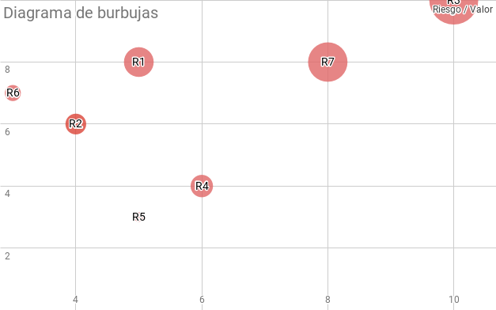
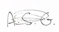
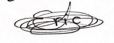

# 1. Introducción

> “We are at the very beginning of time for the human race. It is not unreasonable that we grapple with problems. But there are tens of thousands of years in the future. Our responsibility is to do what we can, learn what we can, improve the solutions, and pass them on.” ― Richard P. Feynman 

En ingeniería de software, un proceso de desarrollo de software es el proceso de dividir el trabajo de desarrollo de software en distintas fases para mejorar el diseño, la gestión de productos y la gestión de proyectos. También es conocido como un ciclo de vida de desarrollo de software. La metodología puede incluir la definición previa de entregables específicos y artefactos que son creados y completados por un equipo de proyecto para desarrollar o mantener una aplicación.

En ingeniería de software, el método de análisis de compensación de arquitectura (ATAM) es un proceso de mitigación de riesgos que se utiliza al principio del ciclo de vida del desarrollo de software. El proceso ATAM es más beneficioso cuanto más temprano se realice en el ciclo de vida del desarrollo de software, cuando el costo de cambiar las arquitecturas es mínimo.

ATAM fue desarrollado por el Instituto de Ingeniería de Software en la Universidad Carnegie Mellon. Su propósito es ayudar a elegir una arquitectura adecuada para un sistema de software mediante el descubrimiento de compensaciones y puntos de sensibilidad.

En este documento de pretensión académica, tomaremos el rol de equipo de evaluación ATAM o equipo ATAM. Pasaremos por las secciones sucesvias trantando cada parte de este proceso y documentando cada decisión tomada para con la arquitectura a evaluar.

Este proceso consta de las siguientes fases:

 - Fase 0: preparación. 
 - Fase 1: evaluación.
 - Fase 2: evaluación, segunda parte.
 - Fase 3: seguimiento.

Asimismo este proceso consta de tres grupos de intersados principalmente:

- Equipo de evaluación, externo al proyecto, evaluadores de la arquitectura.
- Equipo responsable de la toma de decisiones del proyecto (*Project decision makes*), son las personas partícipes en el desarrollo de la arquitectura original y su documentación. El equipo a evaluar.
- Los stakeholders de la arquitectura (*architecture stakeholders*), personas que pueden articular atributos de calidad específicos que la arquitectura debe cumplir.

## 1.1 Propósito del documento

Documento realizado por:

- Luis Mata Aguilar
- Carlos Gómez Robles
- Daniel Rodríguez Manzanero
- Yeray Granada Layos
- María Gallego Martín
- Alejandro de la Fuente Perdiguero
 
El propósito de este documento es evaluar la arquitetura software recogida en el documento "a_evaluar.pdf" del repositorio de GitHub [lmataa/ehealth-eval-doc](https://github.com/lmataa/ehealth-eval-doc). El cual corresponde al resultado de la primera práctica de la asignatura de Arquitectura y Diseño SW del grupo GIWM31 redactado por:

- Pérez Souza, Miguel Ángel
- Romero Andrés, Eric
- Sastre Gallardo, Alberto
- Torres Sánchez, Alfonso
- Vila Marin, Carlos

El documento está dirigido a un conjunto de stakeholders de dicho proyecto, entre los que destacan sobre los demás *"Project decision makers"*, o responsables de la toma de decisiones del proyecto, así como los stakeholders referentes a la arquitectura, responsables de gestionar atributos de caldiad que la arquitectura debe cumplir.

## 1.2 Definiciones, Acrónimos y Abreviaturas

En esta sección se incluye:

- Definiciones de términos usados en este documento requeridos para la correcta interpretación de las construcciones lingüisticas empleadas.
- Acrónimos utilizados en el documento relacionados con el dominio del problema.
- Abreviaturas utilizadas a lo largo del documento.

### 1.2.1 Definiciones

- **Atributos de calidad**: cualidad deseable del sistema, que puede manifestarse en forma de requisito no funcional, medible, testeable y evaluable. 
- **Riesgo**: decisión arquitectónica que puede generar consecuencias indeseables para con los requisitos de atributos de calidad.
- **No riesgo**: decisión arquitectónica que tras análisis se considera segura.
- **Stakeholder**: cualquier persona, organización, sistema o empresa que tiene interés en el proyecto que se describe.
- **Puntos de sensibilidad**: propiedad de un componente fundamental para el éxito del sistema. El sistema es sensible a este punto para su correcto funcionamiento.
- **Puntos de equilibrio**: propiedad que afecta a mas de un atributo o punto de sensibilidad. El sistema requiere de un equilibro en este punto.

### 1.2.2 Acrónimos y Abreviaturas

- **NDA**: Non-disclosure agreement, acuerdo de confidencialidad
- **UPM**: Universidad Politécnica de Madrid
- **ETSISI**: Escuela Ténica Superior de Ingeniería de Sistemas Informáticos
- **ADS**: Arquitectura y diseño Software
- **ASR**: Architecture Significant Requirement
- **BG**: Business Goal
- **BD**: Business Driver
- **ATAM**: Architecture Tradeoff Analysis Method

## 1.3 Referencias

En esta sección se incluyen todas las referencias bibliográficas consultadas para la elaboración de este documento.

Citation | Table
---------|-------
 Mark Richards | Software Architecture Patterns
 Len Bass | Software Architecture in Practice, Second Edition
 Wikipedia, 2019 | [Architecture tradeoff analysis method](https://en.wikipedia.org/wiki/Architecture_tradeoff_analysis_method)

Table: Referencias

  
  
\  
\
\

## 1.4 Estructura del documento

El presente documento se ha organizado como sigue:

- **Capítulo 1**: se realiza una introducción que incluye el propósito del documento, definiciones, acrónimos, y abreviaturas utilizados así como las referencias bibliográficas consultadas.

- **Capítulo 2**: memoria del desarrollo la fase 0 del proceso ATAM referente a la validación de una arquitectura software.

- **Capítulo 3**: memoria del desarrollo de la fase 1 del proceso ATAM referente al análisis de business goals, business drivers, patrones arquitectónicos, atributos de calidad, etc.

- **Capítulo 4**: artefacto de análisis de los escenarios existentes así como la identificación de nuevos escenarios.

- **Capítulo 5**: corresponde a la fase 3 del proceso ATAM, follow up, queda introducida pero está fuera del alcance de este documento.

- **Capítulo 6**: principales conclusiones del trabajo de evaluación.

- **Capítulo 7**: anexo 1 con el acta de reuniones.

- **Capítulo 8**: anexo 2 con el NDA firmado por las partes.

# 2. Fase 0: Preparación

En esta fase de la evaluación ATAM, se le da comienzo al proceso de evaluación. En primer lugar, como actiidad principal, el equipo va a organizar el proyecto de evaluación mediante reuniones, planificaciones logísticas, calendario, acuerdo de puntos en común, etc. Se presentó un NDA para ser firmado por el equipo de evaluación y que así queden protegidos los secretos comerciales al respecto de la arquitectura en cuestión.

Hemos utilizado una planificación ágil para el desarrollo de la evaluación arquitectónica de forma que, llevando un control de versiones del documento mediante GitHub, hemos podido trabajar colaborativamente y ajustar las puestas en común del presente documento a lo largo de las reuniones propuestas.

En nuestro caso la evidencia de las reuniones realizadas se reflejan en el anexo 1. La primera es la puestá en común y presentación de la arquitectura, reflejada en el acta 1.

A continuación en presenta un calendario de reuniones propuestas.

Semana | Fase ATAM / Objetivos reunión | Reunión equipo evaluado 
-------|-------------------------------|------------------------
1/05 | Fase 0: preparación | N/A
6/05 | Fase 1: Presentación de ATAM | 9/05/2019, Acta 1, NDA
6/05 | Fase 1: Business drivers, presentación de la arquitectura | 10/05/2019, Acta 2
13/05 | Fase 1: Identificación de enfoques arquitectónicos, árbol de utilidad | N/A
13/05 | Fase 1: Generación del árbol de atributos de calidad | 13/05/19, Acta 3
13/05 | Fase 1: Enfoques arquitectónicos  | N/A
13/05 | Fase 2: Completa | N/A
20/05 | Fase 3: Follow-up y Conclusiones | N/A

:Planificación de reuniones

En el anexo 2 se recoge el NDA firmado entre las partes.

Una de las tareas que se ha realizado en esta fase es la identificación, dentro del equipo de evaluación, de los diferentes roles de equipo; en la tabla siguiente se recogen éstos.

Rol | Persona
----|--------
Líder del equipo | Luis Mata Aguilar
Líder de evaluación | Daniel Rodríguez Manzaneroo
Escriba de escenarios | Yeray Granada Layos
Escriba de actas | Carlos Gómez Robles
Entrevistador 1 | María Gallego Martín
Entrevistador 2 | Alejandro de la Fuente Perdiguero

:Roles del equipo ATAM

La planificación inicial pretende mantener realizando al equipo un trabajo constante condensado en iteraciones.  Mediante reuniones en el tiempo a lo largo de 4 semanas, se prevee que se podrá realizar en su totalidad la evaluación solicitada. Así mismo se preveen periodos de tiempo suficientemente condensados como para que existan huecos temporales en los que el equipo de evaluación pueda antender sus competencias externas a este proyecto.

# 3. Fase 1: Evaluación inicial

El proceso de evaluación principal definido en ATAM, se especifica en las fases 1 y 2, correspondientes a las secciones 3 y 4 de este documento.

En esa sección se reflejan los resultados de la primera fase en concreto. El equipo evaluador presenta al equipo del proyecto el proceso ATAM, se describen los pasos a seguir así como las preguntas a responder por el equipo evaluado.

A continuación se presentan Business Goals y Business Drivers del proyecto, incorporando las funciones principales del sistema.

## 3.1 Identificación de Business Goals y Business Drivers

Un Business Goal (objetivo de negocio) se define para un sistema como "la razón para construir dicho sistema" y un Business Driver como la manera en la que se pretende alcanzar dicho objetivo descrito en los Business Goals.

Los Business Goals definidos en el proyecto objeto de evaluación son los siguientes:
    
- 1. Lograr una gestión eficiente de las citas, de manera que el usuario sea capaz de pedir cita en hospitales y centros de salud de forma sencilla y veloz en cualquier momento.
    
- 2. Disposición de los usuarios de un método de asistencia automatizada. Cualquier usuario, especialmente aquellos con *un estado de salud delicado*, estén monitorizados. En caso de accidente, podrán recibir asistencia sanitaria lo más brevemente posible. 
    
- 3. Identificación de pacientes mediante escáner biométrico. Se presupone más rápido y eficiente el proceso de identificación, especialmente en accidentes y extingue la necesidad de que pacientes tengan que llevar documentación. Tipos considerados:
    * 3.1 Huella dactilar
    * 3.2 Iris

Los Business Drivers definidos en el proyecto objeto de evaluación son los siguientes:

- 1. Desarrollo de un sistema software de gestión de citas conectado con sistemas informáticos de la Seguridad Social y clínicas privadas participantes.
- 2. Desarrollo de aplicación móvil para el usuario final, podrán pedir tres tipos de cita:
    - 2.1 Cita normal: Cita al usuario en su centro médico habitual.
    - 2.2 Cita extraordinaria: Cita al usuario en centro diferente de su centro habtual (bien porque esté lejos físicamente) en cuyo caso se utilizarán servicios de geolocalización del dispositivo móvil. Se indicarán los centros médicos más cercanos y el usuario podrá elegir donde pedir cita.
    - 2.3 Cita de urgencia: Se le muestran al usuario hospitales cercanos que podrá elegir el más conveniente. El hospital recibirá una notificación informativa con la idea de evitar congestión en urgencias.

- 3. Monitorización a través de dispositivos IoT (Pulseras y relojes inteligentes). Mediante la aplicación móvil, los usuarios podrán vincular dispositivos IoT para detectar anomalías vitales como caída o paro cardíaco. En caso de detectar una anomalía semejante el sistema avisará a urgencias de forma automática para que el afectado reciba asistencia médica con la mayor brevedad posible.

- 4. Identificación de usuarios mediante escáner biométrico. Todo usuario dispone de un perfil virtual con sus datos personales (DNI, NIE, etc.), sus datos de Seguridad Social, seguro de salud privado si procede y datos biométricos bien sea huella dactilar o iris.

Hasta aquí la identificación de la documentación de partida. A continuación vamos a exponer nuestros criterios para una mayor conformidad en la evaluación. En cuanto a los Business Goals deben tenerse en cuenta los siguientes criterios:

- Tienen impacto *directo* en el sistema.
- Pueden implicar restricciones y otras limitaciones en el sistema.
- No están presentes en otros documentos.

Para conseguir estos objetivos es fundamental que su definición sea unívoca, siguiendo las recomendaciones de los profesores de la asignatura de Arquitectura y Diseño Software, plantearemos las características necesarias de la definición de Business Goals de acuerdo a la metodología SMART:

- S: *Specific* / Específico: que expresa claramente qué es exactamente lo que se quiere conseguir.
- M: *Measurable* / Medible: que se puedan establecer variables que determinen su éxito, fracaso o la evolución de los mismo a lo largo del tiempo.
- A: *Attainable* / Alcanzable: ha de tenerse en cuenta dimensiones de esfuerzo, tiempo y otros costes derivados para determinar si son viables, o si quedarán fuera del alcance.
- R: *Relevant* / Relevantes: útiles para el cliente.
- T: *Time-Related* / Con un tiempo determinado: ha de tener un contexto temporal.

**Business Goals: muy breves y genéricos, sin indicadores que permitan su evaluación. Les asignamos en lo que sigue los siguientes identificadores.**

Referencia | Business Goal | Comentario
-----------|---------------|-----------
BG1 | Lograr una gestión eficiente de las citas, de manera que el usuario sea capaz de pedir cita en hospitales y centros de salud de forma sencilla y veloz en cualquier momento. | Faltan indicadores que permitan verificar el Business Goal.
BG2 | Disposición de los usuarios de un método de asistencia automatizada. Cualquier usuario, especialmente aquellos con *un estado de salud delicado*, estén monitorizados. En caso de accidente, podrán recibir asistencia sanitaria lo más brevemente posible. | No hemos encontrado definición para estado de salud delicado en el documento original. Faltan indicadores.
BG3 | Identificación de pacientes mediante escáner biométrico. Se presupone más rápido y eficiente el proceso de identificación, especialmente en accidentes y extingue la necesidad de que pacientes tengan que llevar documentación. Tipos considerados: huella dactilar e iris. | Parece más un Business Driver de un Business Goal de integridad o eficiencia a la hora de identificar pacientes.

:Análisis de Business Goals

En la tabla siguiente se recoge el análisis de los Business Drivers, el cómo se pretenden conseguir los objetivos anteriormente descritos.

Referencia | Business Driver | Comentario
-----------|-----------------|-----------
BD1 | Desarrollo de un sistema software de gestión de citas conectado con sistemas informáticos de la Seguridad Social y clínicas privadas participantes. | No se menciona el servidor que posteriormente se usará para esta labor.
BD2 | Desarrollo de aplicación móvil para el usuario final, podrán pedir tres tipos de cita: normal, extraordinaria, urgencias. | Suponemos que este Driver está ligado al segundo Business Goal, por tanto, nos falta información sobre el cómo, no queda claro.
BD3 | Monitorización a través de dispositivos IoT (Pulseras y relojes inteligentes). Mediante la aplicación móvil, los usuarios podrán vincular dispositivos IoT para detectar anomalías vitales como caída o paro cardíaco. En caso de detectar una anomalía semejante el sistema avisará a urgencias de forma automática para que el afectado reciba asistencia médica con la mayor brevedad posible. | Más cercano a procedimiento que a Business Driver. Se entiende que se usarán dispositivos IoT. En nuestra consideración faltaría mencionar una aclaración al tipo de sistema crítico que se pretende construir, debido a la alta tasa de errores de estos dispositivos biométricos echamos en falta verificación de datos.
BD4 | Identificación de usuarios mediante escáner biométrico. Todo usuario dispone de un perfil virtual con sus datos personales (DNI, NIE, etc.), sus datos de Seguridad Social, seguro de salud privado si procede y datos biométricos bien sea huella dactilar o iris. | BG3 hecho Business Driver. El BG que pensamos para este Driver sería la identificación de usuarios mediante escáner biométrico.

:Análisis Business Drivers

## 3.2 Análisis de patrones arquitectónicos
Los patrones arquitectónicos ayudan a definir las características básicas y comportamientos de una aplicación. Conocer estas características, fortalezas y debilidades de cada patrón es necesario para poder elegir aquel que pueda suplir 

Uno de los aspectos más importantes de los patrones arquitectónicos es que están asociados a diferentes atributos de calidad. Esto quiere decir que existen algunos patrones que representan soluciones abstractas para problemas de rendimiento y otros pueden ser utilizados con éxito en sistemas que requieran de una alta disponibilidad. Al comienzo de la fase de diseño, un arquitecto de software escoge qué patrones arquitectónicos se adaptan más confortablemente a las necesidades de calidad deseadas para el sistema objetivo.

Entre los múltiples patrones arquitectónicos que existen, hemos visto en detalle como contenidos de la asignatura: 

- Layered Architecture
- Event-Driven Architecture
- Microkernel Architecture
- Microservices Architecture Pattern
- Space-Based Architecture

A continuación se prodece a la identificación de los patrones arquitectonicos usados.

### 3.2.1 Microservices

El equipo evaluado identifica en la vista de procesos un patrón arquitectónico de microservicios para los procesos realizados en el back-end del servidor donde se procesan los servicios. Sin embargo y debido a cariz de aplicación crítica que se presupone en los Business Goals, este patrón si bien puede crear aplicaciones implementadas que funcionen muy bien, en general este patrón no se presta a aplicaciones de alto rendimiento debido su naturaleza distribuida.

Por otro lado la testabilidad y la escalabilidad del sistema tratado se ven directamente afecadas positivamente por este patrón. De forma que cada proceso del sistema sería más sencillo de probar. Así mismo sería muy versátil para la adaptación de cambios o extensión de la aplicación para und desarrollo continuo en el futuro.

### 3.2.2 Event-Driven

El patrón principal que considera el equipo de evaluación que se ha seguido es el de *event-driven architecture* debido al uso de sistemas IoT con un servidor que gestiona las conexiones y una aplicación de móvil que gestione los eventos de análisis de mediciones de dichos dispositivos.

Se trata de que conforme se use la aplicación propuesta por el equipo original de diseño, los eventos se dispararán desde el primer momento. Primero en la captura de datos por los dispositivos y de ahí se propagarán eventos en forma de conexiones hasta los envíos de notificaciones a los centros médicos, tal y como se propone originalmente.

Además este tipo de patrón se usa en sistemas que requieran de una componente altamente asíncrona, como son los sensores IoT, lo cual minimizará el tiempo de respuesta, que además sería un atributo de calidad derivado de todos los Business Goals originalmente planteados.

Sin embargo este patrón arquitectónico no se ha visto considerado por el equipo de diseño.

## 3.3 Árbol de atributos de calidad

Un atributo de calidad es una propiedad medible o comprobable de un sistema que se utiliza para indicar cómo de bien el sistema satisface las necesidades de sus stakeholders.

En las tablas siguientes se recogen tanto atributos de calidad cómo el árbol de utilidad identificado por el equipo objeto de evaluación.

Atributo de calidad | Prioridad | Justificación
--------------------|-----------|--------------
Disponibilidad | Alta | En caso de emergencia el sistema necesita estar disponibl en cualquier día y hora del año.
Interoperabilidad | Alta | El sistema debe poder ser solicitado desde cualqueir dispositivo compatible.
Rendimiento | Alta | La respuesta del sistema debe resultar en el menor tiempo posible.
Seguridad (Security) | Media | Se tratan datos personales y sanitarios de pacientes. Según el RGPD son datos especialmente sensibles.
Escalabilidad | Media | El sistema debe tener la capacidad de soportar la interacción de un gran número de usuarios al mismo tiempo sin que se vea afectado su funcionamiento.
Portabilidad | Media | El sistema debe ser capaz de funcioanr correctamente en la mayoría de dispositivos.
Usabilidad | Baja | El sistema debe poder ser usado fácilmente.
Modificabilidad | Baja | El sistema debe poder ser modificable para facilitar el mantenimiento.
Testabilidad | Baja | El sistema se debe poder probar de forma sencilla.

:Atributos de calidad

Atributo de calidad | Atributo refinado | Architecture Significant Requirement
--------------------|-------------------|-------------------------------------
Disponibilidad | Tiempo disponible | El sistema estará disponible 24 del día, todos los días del año 
 - | Horario de actualización | En caso de que sea necesario mantenimiento o actualización, se llevará a cabo de 3 AM a 5 AM y no se inhabilitarán todas las funcionalidades, solo aquellas que vayan a ser actualizadas o mantenidas.
Interoperabilidad | Conexión con otros sistemas | El sistema se comunicará con los sistemas informáticos de la sanidad pública y las clínicas privadas que participen en el sistema
- | Conexión con dispositivos | El sistema será compatible con dispositivos de monitorización tipo relojes y pulseras inteligentes (inicialmente Apple Watch, Samsung Galaxy Watch, Samsung Gear Fit 2, Xiaomi Mi Band 2 y 3, Armazfit Bip, Fitbit Versa y Fitbit Inspire)
Rendimiento | Tiempo de respuesta (cita) | Cuando un usario solicita una cita el tiempo de respuesta del sistema para asignarle la cita no será mayor de 5 segundos.
- | Tiempo de respuesta (llamada a emergencias) | Cuando uno de los dispositivos de monitorización detecta una parada cardíaca o caída, el sistema responderá llamando a emergencias en un plazo máximo de 20 segundos.

:Árbol de utilidad original

A continuación, se procede al análisis de los atributos de calidad a partir de los Business Goals.

Atributo de calidad | Prioridad | Justificación   | Análisis realizado
--------------------|-----------|---------------|-------------------------------
Disponibilidad | Alta | Monitorización en tiempo real y detección de anomalías en tiempo real. Sistema de emergencia sanitario, por lo tanto crítico, y no puede fallar además de estar disponible en todo momento. | Se detecta de **GB1**. Consideramos que este sistema requiere de un nivel de disponibilidad muy alto, especialmente si hay vidas humanas de por medio. Por lo que categorizamos el sistema como crítico. Es un atributo de vital importancia.
Interoperabilidad | Alta | El sistema establecerá comunicaciones con sistemas informáticos ajenos como el de sanidad pública y será compatible con dispositivos de monitorización tipo relojes y pulseras inteligentes (IoT). | No se menciona en los BG, se presuone por la descripción y los drivers. Quizás asociable con **BG2**.
Rendimiento | Alta | Tiempo de respuesta, sincronización y reconocimiento de patrones biométricos en un tiempo aceptable. | Detectado de **BG1**. Sin métricas asociadas en BG.
Seguridad | Media | Solo podrán acceder a los datos personales las personas autorizadas. Los datos deben ser íntegros y protegidos frente a modificaciones. Sistema de autenticación. | En los BG no se recoge ninguna restricción de seguridad.
Usabilidad | Baja | Aplicación accesible y fácil de usar por ser de uso general con usuarios no expertos. | Nada deducible directamente de los BG. Es importante que sea usable si los usuarios finales de la aplicación no son expertos.
Modificabilidad | Baja | Se podrán realizar cambios en la aplicación con bajo coste. Pensamos que de forma continua sería una adición. No está contemplado en los Business Goals. | No deducible de los BG, quizás en **BG1** al tratar la gestión eficiente, lo cual implicaría que se pudiese modificar con facilidad, con la suficiente abstracción.
Testabilidad | Baja | Verificable y validable. El equipo quiere que sea fácil y rápida de probar. | Nada deducible delos BG. Pero al tratarse de un sistme crítico lo consideramos uno de los atributos más importantes. Debe estar todo probado y funcionar correctamente. No se puede tolerar que un fallo software se pueda cobrar una vida humana.
Escalabilidad | Media | Adaptable a cambios y extensiones. Márgenes planteados para aceptar aumentos significativos de datos y usuarios. | No deducible de los BG, importante para un sistema de este tipo, al ser un sistema ehealth que pretende captar usuarios de población civil en una ciudad.
Portabilidad | Media | Compatibilidad con Android e iOS | Nada derivable de los BG. No es muy importante que sea portable al principio debido a que las aplicaciones de un sistema de este tipo con el diseño adecuado, pueden ser fácilmente desplegadas a dispositivos finales.

:Ánalisis de atributos de calidad con Business Goals

A continuación, se analiza el árbol de utilidad, planteando cómo podrían quedar los atributos de calidad y refinados, la prioridad que identificamos en base al análisis de Business Goals, y el impacto global en la arquitectura y el valor de negocio, de cada uno de ellos. En algunos casos los atributos se verán modificados y en otros podría ser propuesta su eliminación. 

Atributo de calidad | Atributo refinado | Prioridad | Justificación de las decisiones
--------------------|-------------------|-----------|---------------------------
Confiabilidad | Disponibilidad | 1 | Al tratarse de un sistema crítico, debe estar planteado desde el primer momento en el diseño una disponibilidad 24/7 para evitar posibles daños a pacientes u otros inconvenientes. (**H,H**). ASR: Como cliente quiero que el sistema de alertas y emergencias esté disponible para detectarlas al menos un 99,90% del tiempo.
 - | Reconocimiento de patrones | - | La identificación de datos biométricos debe ser fehaciente a la realidad y ser confiable en cuanto a fallos, además de realizar la identificación en menos de medio segundo. (**H,L**). ASR: Como cliente quiero que el sistema reconozca con una tolerancia del 96% y en menos de medio segundo quién soy utilizando mis datos biométricos.
 Rendimiento | Time behaviour | 2 | Dada la cantidad de información que maneja el sistema y que ha de disponerse de ella en tiempo real, el tiempo de respuesta al usuario debe ser mínimo. (**H,H**). ASR: Como cliente quiero poder notificar emergencias en menos de 5 segundos y citas en menos de 20 segundos.
 - | Utilización de recursos | - | La sincronización de los dispositivos exige un escenario de tiempo real, por lo que deben minimizarse las diferencias de tiempo entre los datos en el servidor y los recién captados. (**H,H**). ASR: Como cliente quiero que la informaicón del sensor sea procesada por el sistema en menos de 2 segundos.
 Seguridad | Integridad | 3 | Los datos estarán protegidos frente a modificaciones no autorizadas (ej: Man-in-the-middle). (**M,H**). ASR: Como cliente quiero que mis datos personales estén protegidos y estén correspondidos con la realidad captada.
- | Control de accesos | - | Determinadas funciones del sistema deben estar restringidas a perfiles concretos de usuario. Como la calibración de dispositivos, o el acceso a identificadores biométricos. (**L,M**) ASR: Como cliente quiero que al sistema solo puedan acceder ciertos perfiles establecidos, especialmente a la configuración de dispositivos de captación de datos sensibles.
- | Confidencialidad | - | Dado el tipo de información personal y médica que procesa el sistema, ningunas terceras partes podrán acceder a estos datos personales. Los responsables de datos deben firmar y someterse a la responsabilidad del trato de dichos datos. (**H,H**). ASR: Como cliente quiero ejercer mi derecho de privacidad y proteger así mis datos personales.
Usabilidad | Facilidad de uso | 5 | Al tratarse de una aplicación de uso general y no especialista, debe ser fácil de usar para todo el mundo. (**L,M**). ASR: Como cliente quiero que la aplicación sea fácil de usar para garantizar un uso universal de la misma, especialmente al tratarse de un sistema e-health.
- | Accesibilidad | - | Además de ser fácil de usar, el sistema se contempla accesible universalmente, para establecer su uso a personas con limitaciones cognitivas, o sensoriales. (**M,L**). ASR: Como cliente quiero poder usar la aplicación sea cual sea mi condición física o psíquica.
Mantenibilidad | Escalabilidad | 4 | El sistema debe estar diseñado desde el principio para poder escalar horizontalmente, esto es, dar respuesta al incremento de usuarios previsto. (**H,M**). ASR: Como cliente quiero que el sistema sea escalable horizontalmente para no experimetar pérdidas de rendimiento con la popularización del uso en incrementos contemplados del 30% de usuarios, en un tiempo de 5 días/persona.
- | Modificabilidad | - | El sistema debe estar diseñado para soportar cambios de funcionalidad pertinentes de acuerdo con las posibles espeficicaciones de los stakeholders. Además se trata de un sistema en fases de prueba por lo que debe estar especialmente preparado para esto. (**M,H**). ASR: Como cliente el sistema debe poder ser lo suficientemente flexible como para incluir cambios de funcionalidad solicitados por stakeholders.
- | Testabilidad | - | Al tratarse de un sistema crítico, la correcta funcionalidad de todos los componentes debe estar verificada y validada con un umbral de tolerancia del 100% en los procesos críticos y un 80% en los componentes de interfaz. (**M,H**). ASR: Como cliente quiero que la aplicación esté validada y verificada, para no comprometer a los pacientes a fallos del sistema en cuestiones vitales.
Portabilidad | Adaptabilidad | 6 | La aplicación final de usuario del sistema debe poder ejecutarse tanto en Android como en iOS. Se pretende la universalización del sitema en cuanto a dispositivos. (**L,H**). ASR: Como cliente quero que el 100% de las funcionalidades de usuario se puedan realizar desde dispositivos Android e iOS.

:Árbol de utilidad propuesto

Del análisis de los atributos de calidad y árbol de utilidad, decidimos la reestructuración anterior por su compresión y en nuestra consideración, por su mejor etiquetado de atributos refinados. Así mismo eliminamos algunos atributos de calidad que consideramos que no tienen relevancia cruzada en el sistema. Siendo la nueva especificación propuesta más acorde a lo que se pretende conseguir con los Business Goals. Especialmente, cabe hacer incapié en los atributos refinados de **mantenibilidad**, que es el atributo de calidad nuevo que más sufre refactorización.

Así mismo, del análisis de los Business Goals, echamos en falta algún Business Goal conforme a como se presentó originalmente el sistema. Así mismo, no se presentaban con etiquetas reconocibles en el documento orginal por lo que hemos procedido a asignarles un nombre con el formato **BG1** para referirnos a ellos. A parte de ser muy breves, también consideramos que se han pasado por alto identificar métricas para los mismos.

## 3.4 Análisis de stakeholders

Grupos de prioridad identificados por el equipo de proyecto y nuestra reflexión al respecto.

Stakeholders, hace referencia a cualquier persona o grupo de ellas que se vean afectados o afectan a las actividades del proyecto, ya sea de forma positiva o negativa, deben ser considerados como un elemento esencial en la planificación estratégica del mismo. 
En el documento de arquitectura se deben considerar aquellas personas o conjuntos de personas que pueden influir en el diseño de la arquitectura, en base a sus necesidades y peticiones.
El equipo de proyecto ha considerado los siguientes stakeholders:

Stakeholders | Prioridad 
-------------|----------
Organizaciones sanitarias públicas y privadas | Alta
Fabricantes de dispositivos de monitoriazción | Alta
Usuarios | Media
Personal sanitario | Media

: Stakeholders originales

El equipo de evaluación considera las siguientes aportaciones: 

•	Organizaciones sanitarias públicas y privadas: Son consideradas como los clientes del proyecto. Su prioridad es alta ya que sus intereses abarcan : costo, calidad, vida del proyecto y la posibilidad de hacer cambios. 

•	Fabricantes de dispositivos de monitorización: Considerados como prioridad el grupo a evaluar justifica correctamente porqué se corresponden con una prioridad alta. Pero nos gustaría además incluir otros aspectos importantes que afectan al desarrollo y planificación del proyecto:  ganancia y amortización de los costos, adherencia a los procesos internos, calidad, reusabilidad de los dispositivos.

•	Usuarios: Nuestro equipo de corrección discrepa en cuánto a la prioridad de este conjunto, y los pone con prioridad alta, justificando que los intereses de este grupo son de grandes intereses a la hora de desarrollar la planificación y arquitectura. Dentro de estos intereses incluimos: Facilidades de uso del sistema, seguridad, Personalización, configuración, etc. Nos gustaría además resaltar que no se  especifica quienes son los usuarios, si son los pacientes generales o los de especial seguimiento. Sería necesario diferencias a estos dos tipos de pacientes. 

Además de los ya descritos nos gustaría incluir: 

•	Grupo de desarrolladores: Estos tienen que conocer la arquitectura que se va a implementar junto con los estándares de desarrollo y componentes reusables. Además de la necesidad de añadir facilidades para hacer cambios.

•	Administradores del Sistema: Con los diferentes intereses, simple configuración, monitoreo o administración de los servicios, disponibilidad y escalabilidad. 

•	Arquitecto Software: Tendrá que entender las restricciones reales del sistema y manejar las expectativas de todos los stakeholders.

•	Jefe del Proyecto

  

## 3.5 Análisis de vistas

Para analizar el sistema usaremos el sistema de 4+1 vistas de Kruchten, que consiste en las siguientes vistas, las cuales detallaremos en esa subsección.

- Vista lógica
- Vista de procesos
- Vista de desarrollo
- Vista física o de despliegue
- Vista de escenarios

### 3.5.1 Vista lógica

#### Descripción

La vista lógica está relacionada con los requisitos funcionales y la estructra de clases conceptual que se va a usar en el sistema una vez construido. El objetivo es mostrar los componentes software del sistema y sus relaciones.

#### Análisis

Para la elaboración de esta vista han utilizado la notación UML de diagramas de clases estándar, donde comentan que cada entidad, representada por un cuadro con su nombre, donde mencionan la cardinalidad, pero no justfican el porqué de todas esas cardinalidades y creemos que es importante, puesto que para entender la vista en su totalidad, un apartado como las cardinalidades y la explicación de las mismas es necesario para comprender todas las relaciones. 

A nuestro parecer faltaría al menos una relación más, en concreto entre cliente y entidad sanitaria, donde la interacción entre ambos es directa, donde el cliente es atendido y donde la entidad sanitaria tiene registrado datos de cliente, y especialistas sanitarios que atienden a pacientes.

Se ha encontrado una inconsistencia en el Catálogo. En la vista hay un total de 5 entidades: Cliente, Pulsera, Móvil, Cuenta y Entidad Sanitaria. Sin embargo a la hora de mencionarlos y desarrollarlos en el catálogo, a lo que llamaban Cliente ahora se lo denomina Usuario. Deben tener el mismo nombre tanto en la vista como el catálogo.

Concluyendo, pese a la correcta justificación en su mayoría, la vista lógica debería tener algunas entidades y relaciones más.

#### Atributos de calidad

Respecto al Rationale se justifican la interoperablidad entre los distintos dispositivos, en este caso son móvil y pulsera asociados a una entidad sanitaria.

### 3.5.2 Vista de procesos

#### Descripción

El objetivo de un diagrama de procesos es mostrar uno o varios procesos del sistema software o del negocio mediante un flujo de trabajo. Este flujo comienza en un punto inicial y a continuación por una serie de tareas que pueden ser iterativas hasta llegar al punto final.

#### Análisis

Para el desarrollo del diagrama de actividades han utilizado el estándar UML, de forma que sea accesible y fácilmente interpretable para el mayor número de personas. 

Analizando la vista de procesos, la estructura basándonos en los “business goals” no me parece correcta por los siguientes motivos:

1.	Los avisos de emergencia no están bien definidos entre la pulsera, el teléfono móvil y el servidor que genera la llamada.
2.	No se hace mención a los sistemas biométricos para reconocer al paciente.

#### Justificación: Atributos de calidad

Se resalta la importancia de la interoperabilidad entre los diferentes elementos del sistema como son la pulsera, el teléfono móvil y el servidor para el correcto funcionamiento del sistema utilizando estos elementos para cumplir las funciones de la aplicación

### 3.5.3 Vista de desarollo

#### Descripción

El objetivo del diagrama de componentes es la organización del software en módulos para su desarrollo. Se pueden organizar los componentes en caoas o interfaces para su mejor comprensión. Lo cual lo facilitará la intuición de estos paquetes de software a la hora de implementar y desarrollar el sistema. 

#### Análisis

Se especifican tres diagramas en el documento original. Los tres corresponden a cada dispositivo del sistema: Entidad sanitaria, móvil y pulsera. Sin embargo no aparece por ningún lado el servidor ni los paquetes de componentes software de esta máquina. Lo consideramos una falta de información importante.

Se considera que todo el procese lo realiza esta máquina y pese a ello no disponemos de información en esta vista para su análisis. Sin embargo los paquetes software de los dispositivos finales están bien organizados. Los tres siguen arquitectura en capas.

Se desacopla correctamente la interfaz de la lógica y de la comunicación de cada dispositivo, permitiendo así un trabajo ágil y modificable como se indica en los atributos de calidad.

#### Justificación: Atributos de calidad

Con vistas a nuestro nuevo árbol de utilidad propuesto, cabría utilizar componentes de reflexión para saber el estado del sistema en cada momento y así, además de monitorizar datos de pacientes, podría monitorizarse el flujo de datos dentro del sistema y así poder redirigir los canales saturados. Esto llevaría el atributo de calidad de mantenibilidad a un nivel superior.

No se ve reflejada la disponibilidad que es el atributo más importante y debería ir de la parte del servidor, capaz de recoger los eventos lanzados por estos dispositivos.

Otra consideración a tener en cuenta es el uso de un patrón de broker, que podría aplicarse de cara a la captación de eventos por el servidor (ausente).

Si bien, se refleja la interoperabilidad en comunicación de los componentes, pero eliminamos este atributo de calidad por obvio, ya que se entiende que componentes diferentes de este sistema estarán conectados para interactuar tal y como se especifica.

Tampoco se refleja el atributo de rendimiento y seguridad por el lado de esta vista, para reflejarlo podrían incluirse paquetes de componentes que traten ambos problemas. 

### 3.5.4 Vista de despliegue

#### Descripción

La vista de despliegue tiene como objetivo asociar a cada elemento de las vistas anteriores un dispositivo físico donde se ejecutarán o residirán dichos componentes. Hablamos de redes, procesos, tareas, objetos, en diferentes nodos de este diagrama que podrán ser servidores, nodos de red, dispositivos finales ...

#### Análisis

En esta vista si aparece el componente de servidor como un nodo donde se ejecutan procesos. Esto no se veía reflejado en el diagrama de desarrollo. 

Aparece por primera vez una base de datos que no estaba contemplada en el documento hasta este momento. Se mencionan historiales de pacientes cosa no descrita en los BG.

Por lo demás queda lo suficientemente claro e ilustrativo de cómo se desplegará el sistema.

#### Justificación: Atributos de calidad

Según se indica, están bien mapeados los componentes del diagrama de procesos. Sin embargo no está bien mapeado con el diagrama de componentes, lo cual supone una inconsistencia.

Se refleja la interoperabilidad inicialmente planteada pero eliminada por el equipo de evaluación por motivos obvios.

Nos faltaría para tener un sistema consistente con sus BG, un servidor de backup para mantener la disponibilidad del sistema. Requisito de prioridad máxima, tal y como se ha identificado. Esto supondría una mejora de calidad importante para el sistema propuesto.

Para la disponibilidad en los canales de comunicación se proponen canales alternativos o cableados en caso de fallo para garantizar también la disponibilidad que este sistema crítico debe tener.

### 3.5.5 Vista de escenarios

#### Descripción

La vista de escenarios nos ofrece la posibilidad de mostrar las diferentes formas que tienen los usuarios de interactuar con el sistema.

#### Análisis 

En este caso para la vista de escenario se ha usado la notación UML estándar para casos de uso, explicando de forma muy completa cada elemento usado y su función. En concreto: Actor, caso de uso, ventana y asociación, cada uno representado con una imagen para su correcta identificación.

Se nos presenta un caso de uso que representa la interacción de los diferentes elementos del sistema. Consta de cuatro actores: Entidad sanitaria, Servidor, Móvil y Banda inteligente, y éstos, a su vez, estan asociados mediante relaciones con los elementos del sistema, que son: Gestión de citas, Recepción y gestión de datos biométricos y aviso de emergencia. En el caso de uso vemos como los distintos dispositivos y entidades interaccionan con los elementos del sistema, pero en ningún momento se muestra de que forma los usuarios/clientes hacen uso de ellos, por lo que sse podría añadir un quinto actor "Cliente". 

Respecto al catálogo, se justifica de forma correcta cada elemento del sistema.

#### Justificación: Atributos de calidad

Se comentan dos atributos de calidad:

- Interoperabilidad: en el caso de uso al tener elementos que se corresponden con dispositivos se puede observar fácilmente la relación que existe entre ellos y como interaccionan.

- Testabilidad: la explicación puede dar lugar a dudas, y además, no podemos ver si los elementos del sistema funcionan de forma correcta y/o óptima, por lo que se podría suprimir la testabilidad de este apartado al no tener una justificación del todo convincente. 

## 3.6 Identificación de puntos de sensibilidad

Se definen los puntos de sensibilidad de un sistema, como los componentes críticos para el éxito (correcto funcionamiento) del mismo. De la evaluación de la arquitectura propuesta hemos identificado los siguientes:

• **PS1**: Calibración del sensor de la pulsera: Es importante para el sistema que el sensor de la pulsera este correctamente calibrado y revisado periódicamente para asegurarnos que las mediciones son correctas, en caso contrario podremos tener 2 problemas de diferente gravedad, que serían:

1.	El sensor mida erróneamente y genera un aviso de emergencia cuando el paciente está bien, generaría falsas alertas que no son necesarias, es problemático, pero no peligra la salud del paciente.
2.	El sensor no mida una emergencia real por un problema de salud del paciente y no se genera la alerta, esto hace peligrar la salud del paciente.

• **PS2**: Conectividad entre la pulsera y el teléfono móvil: Perder la conectividad entre el sensor de la pulsera y el teléfono móvil es crítico para el sistema. Sin esta conexión, el sistema no recibe las alertas de emergencia, aunque se estén produciendo.

• **PS3**: Conectividad entre el teléfono móvil y el servidor: Perder la conectividad entre el teléfono móvil y el servidor es crítico para el sistema. Sin esta conexión, el sistema no recibe las alertas de emergencia, aunque se estén produciendo.

• **PS4**: Necesidad de batería de gran capacidad para asegurar durabilidad en la
comunicación entre la pulsera y el teléfono móvil y entre el teléfono móvil y el servidor: Se necesitará la mayor autonomía posible en la batería de nuestros dispositivos, especialmente de la pulsera que mide las variables del paciente.

. **PS5**: Necesidad de un plan de mantenimiento exhaustivo en el tiempo para incorporar valor de negocio y reducir la deuda técnica del sistema. CI/CD es fundamental para hacer entregars iterativas y poder corregir rápidamente el sistema. De carecer de un gestor de este tipo, el sistema puede conducirse al caos rápidamente conforme escale.

## 3.7 Identificación de puntos de equilibrio

Se definen los puntos de equilibrio de un sistema como una propiedad que afecta a más de un atributo de calidad o punto de sensibilidad. De la evaluación de la arquitectura propuesta, hemos identificado los siguientes:

• **PE1**: Es preferible tener capacidad de procesamiento suficiente para poder procesar los datos de los sensores de forma concurrente en tiempo real, para no tener demoras en las alertas. Sin embargo los tiempos mínimos originalmente pensados son suficientes para la demora que pueda sufrir en tecnología. Pensamos sin embargo que estos tiempos deberían ser menores aún, ya que se trata de un sistema crítico. El principal objetivo del sistema es procesar los datos de los sensores de las pulseras para alertar al usuario. La capacidad de almacenar datos para no perder registros en el servidor es menos prioritaria que la mencionada, ya que aporta menor valor de negocio.

• **PE2**: Es preferible más duración de la batería de la pulsera antes que su tamaño o estética. La función principal de la pulsera es enviar las alertas de emergencia, necesitamos una autonomía mínima de 24 horas enviando los datos, pondremos este aspecto con mayor importancia que una estética o tamaño mas reducido para garantizar el buen funcionamiento del sistema.

. **PE3**: Consideramos los sensores biométricos una funcionalidad con poco valor de negocio para el caso que se plantea. Complicando la implementación por regulaciones de datos personales así como por la necesidad de procesar datos con prioridad para la identificación de personas, lo cual es un riesgo potencial de uso malicioso. Sin embargo si los stakeholders insisten, la prioridad de las identificaciones biométricas podrían estar asignadas para ser procesada en último lugar a la hora de atender los eventos. Con esta transformación sería de utilidad para la población general y no solo pacientes con dispositivos IoT especiales ya que solo tienen que ser escaneados una vez. (Con un tiempo de retorno suficiente como para procesar una imagen del paciente, transportarlo a un hospital y recibir allí la respuesta en caso de emergencia).

## 3.8 Identificación de riesgos

Se define riesgo como una decisión arquitectónica que puede generar consecuencias indeseables a la luz de los requisitos de los atributos de calidad. De la evaluación de la arquitectura propuesta, hemos identificado los siguientes:

- **R1**: Inconsistencias en el sistema (o partes) crítico debidas a vulnerabilidades no probadas. Inevitable, para reducir la amenaza se puede priorizar la Testabilidad del sistema.
- **R2**: El sistema considera la escalabilidad pero sólo con márgenes de usuarios y datos significativos. Se plantea una mantenibilidad activa pero no se prepara para integraciones de nuevas funcionalidades de forma continua. Establecer una estrategia DevOps en despliegue mitigaría este riesgo.
- **R3**: Vunerabilidades en los sitemas de almacenamiento / envío de datos personales sensibles. En caso de haber una violación de la seguridad del sistema se accedería a información muy sensible lo cual puede suponer una amenaza al valor de negocio del sistema así como opinión pública, multa o cese de servicios, etc.
- **R4**: Fallo de conexión: Ya sea al dispositivo IoT como al servidor. Ambos tienen como cuello de botella el dispositivo móvil del usuario lo cual depende exclusivamente de su estado y delegar este poder en el cliente es un riesgo que hay que asumir y contemplar. Si el dispositivo móvil de nuestro cliente no tiene especificaciones suficientes como para poder ejecutar todas las funciones del sistema correctamente pueden ocurrir fallos. Este riesgo se mitigaría limitando versiones en despliegue a ciertos modelos objetivo de la aplicación de usuario final. Se limita la portabilidad.
- **R5**: Potencia de calibración del dispositivo IoT. Es conocido en el sector que estos dispositivos, de no ser especializados, procesan con bastante ruido variables biométricas generales. De usar un reloj inteligente como sensor crítico se asume que el cliente es responsable de ello, pero puede no ser consciente. Si se  da un fallo en este caso, el sistema perdería valor de negocio. Para mitigar este riesgo se propone especializar el sensor objetivo del sistema, sino general con un dispositivo en concreto. También se contempla la opción de crear un sistema software preciso que cumpla esta función.
- **R6**: Oportunidad de análisis de datos y participación en investigaciones pertinentes así como financiaciones potenciales. De incluir una tercera capa al sistema se podría aumentar considerablemente el valor de negocio del sistema. Pudiendo analizar datos y asignar correlaciones y estimaciones en temas de salud pública e investigación. Incluir un análisis de este tipo llamaría la atención de posibles contribuidores al proyecto sin mucho coste adicional.
- **R7**: Fallo permanente en hardware de usuario. Puede no dectectarse un paro de emisiones de un usuario como un fallo hardware sino como una emergencia sanitaria y malgastar recursos por una avería técnica. El riesgo no le impide al sistema realizar su función principal con otros terminales pero pierde recursos en este caso.

A cada riesgo y oportunidad identificada le hemos asignado un valor de negocio, un valor de riesgo y una cantidad de impacto. Representado en el siguiente diagrama de burbujas.

  
  
\  
\  
\  
\  
\
\
\

# 4. Fase 2: Evaluación completa

En la segunda fase continúa el análisis de la arquitectura con los stakeholders del proyecto.

## 4.1 Análisis de escenarios existentes e identificaicón de nuevos escenarios

En está sección se presenta el análisis de escenarios. El objetivo es contar con suficiente información para poder tomar decisiones de diseño con conocimiento de causa y efecto, estableciendo un vínculo con los requisitos de los atributos de calidad que deben cumplirse.

### 4.1.1 Escenario 1

 **Escenario: 1** | Como cliente quiero que el sistema de alertas y emergencias esté disponile para detectarlas al menos un 99,90% del tiempo.
-------------|---------------------------------------
**Atributo** | Disponibilidad
**Contexto** | Operaciones normales
**Estímulo** | Fallo en envío de datos, falso positivo
**Respuesta** | Detección de falso positivo por parte del sistema, comprobación con el usuario por vía de comunicación directa.

:Escenario 1

Decisiones arquitectónicas | Sensibilidad | Equilibrio | Riesgos | No riesgos 
---------------------------|----------|--------------|------------|------|----
 1. Sensor de redundancia | PS1, PS2, PS3 | PE1 | R1, R3, R4, R5, R7 | -
 2. Detección de inconsistencias en el dispositivo móvil | PS4, PS3 | PE1 | R1, R3, R4, R7 | -
 3. Detección de inconsistencias en el servidor | PS3 | PE1 | R1, R2, R3, R4 | -
 4. Mantenibilidad activa, reducción de deuda técnica | PS5 | - | R1 | - 

:Escenario 1 decisiones

#### 4.1.1.1 Razonamiento

Aunque se traten de priorizar la minimización de falsos negativos al falsos positivos, éstos últimos pueden llegar a suponer un coste importante. En el caso de que el sistema esté siempre disponible y se generen alertas de falsos positivos por los clientes puede llegar a sobrecargar la capacidad de acción originalmente planteada. Se proponen sensores de redundacia de información por la parte del usuario, detección en el dispositivo móvil y/o en el servidor. Asimismo en caso de poder llamar al usuario ante una detección de parámetros fuera de rango, se le podría llamar para comprobar que no fuese un falso positivo como última barrera.

Es necesario también tener un plan de mantenimiento activo y continuo, donde recomendamos una estrategia DevOps de CI/CD que esté trabajando en mejoras y soluciones a errores del sistema. Facilita además el despliegue en intervalos de tiempo de caída muy breves o casi nulos, cumpliendo con el ASR de Dispoinibilidad.

#### 4.1.1.2 Diagrama arquitectónico

N/A

### 4.1.2 Escenario 2

 **Escenario: 2** | Como cliente quiero que el sistema reconozca con una tolerancia del 96% y en menos de medio segundo quién soy utilizando mis datos biométricos.
-------------|---------------------------------------
**Atributo** | Reconocimiento de patrones
**Contexto** | Reconocimiento biométrico
**Estímulo** | Toma mucho tiempo
**Respuesta** | Repetir escaneo

:Escenario 2

Decisiones arquitectónicas | Sensibilidad | Equilibrio | Riesgos | No riesgos 
---------------------------|----------|--------------|------------|------|----
 Reducir la funcionalidad | PS3 | PE3 | R6, R4, R3, R2, R1 | -
 Explotar la funcionalidad | PS3 | PE3 | R7, R4, R3, R2, R1 | -
 Aumentar paralelismo | PS3, PS1 | R1, R2, R3, R7 | -

:Escenario 2 decisiones

#### 4.1.2.1 Razonamiento

Como esta funcionalidad es un extra al sistema que no le impide realizar su función principal(entendida ésta como el sistema de notificaciones de emergencia). Consideramos que dado el riesgo que supone tratar estos datos, se proponen dos acercamientos. El primero sería reducir o eliminar esta funcionalidad, limitando por ejemplo, el tipo de usuarios que puede identificar a otros, como personal sanitario. O explotarla y aprovechar tanto procesamiento de datos para favorecer investigaciones e indicadores estadísticos sobre salud pública. En cualquier caso considerar PE3.

Si se aumentan los recursos en este proceso de identificación, podría funcionar en un tiempo considerable. Como se comenta en PE3, es suficiente con un intervalo mucho mayor al planteado por el ASR.

#### 4.1.2.2 Diagrama arquitectónico

N/A

### 4.1.3 Escenario 3

 **Escenario: 3** | Como cliente quiero poder notificar emergencias en menos de 5 segundos y citas en menos de 20 segundos.
-------------|---------------------------------------
**Atributo** | Time behaviour
**Contexto** | Operaciones normales
**Estímulo** | Falla un procesador
**Respuesta** | Aumento significativo del tiempo de respuesta del sistema

:Escenario 3

Decisiones arquitectónicas | Sensibilidad | Equilibrio | Riesgos | No riesgos 
---------------------------|----------|--------------|------------|------|----
 CPU de apoyo | PS2,PS3 | - | - | - 

:Escenario 3 decisiones

#### 4.1.3.1 Razonamiento

A esta funcionalidad se la considerará una parte crítica del sistema, ya que la notificación de emergencias es una de las partes más importantes y significativas del software. El fallo del procesador puede concurrir en la pérdida de notificaciones por parte de los usuarios, por lo que se hace muy necesario un plan alternativo si el procesador fallase. Para solucionar este problema se propone la implantación de CPU's de apoyo para evitar la pérdida de datos y el retardo en el procesamiento de notificaciones.

#### 4.1.3.2 Diagrama arquitectónico

N/A

### 4.1.4 Escenario 4

 **Escenario: 4** | Como cliente quiero que la información del sensor sea procesada por el sistema en menos de 2 segundos.
-------------|---------------------------------------
**Atributo** | Utilizacion de recursos
**Contexto** | Operaciones normales
**Estímulo** | Falla un procesador
**Respuesta** | Disponer de un procesador alternativo

:Escenario 4

Decisiones arquitectónicas | Sensibilidad | Equilibrio | Riesgos | No riesgos 
---------------------------|----------|--------------|------------|------|----
 Pocesador alternativo | PS2,PS3 | PE1 | R4 | - 

 :Escenario 4 decisiones

#### 4.1.4.1 Razonamiento

En caso de que el procesador fallara, sería necesario disponer de un plan alternativo debido a la criticidad de esta parte del sistema. Lo que se persigue es que el sistema siga procesando los datos del sensor ante algún fallo de algún componente físico del procesador para evitar la pérdida de datos. Dispondremos de un procesador auxiliar que se utilizará en caso de que el sensor no recoja datos en un periodo de 1s para así asegurar un escenario de tiempo real.

#### 4.1.4.2 Diagrama arquitectónico

N/A

### 4.1.5 Escenario 5

 **Escenario: 5** | Como cliente quiero que mis datos personales estén protegidos y estén correspondidos con la realidad captada.
-------------|---------------------------------------
Atributo | Integridad
Contexto | Operaciones normales
Estímulo | Acceso a datos personales por personas no autorizadas
Respuesta | Utilización de datos biométricos

:Escenario 5

Decisiones arquitectónicas | Sensibilidad | Equilibrio | Riesgos | No riesgos 
---------------------------|--------------|------------|---------|-----------
 Utilizacion datos biometricos | - | - | R3 | -

 :Escenario 5 decisiones

#### 4.1.5.1 Razonamiento

La seguridad de los datos es algo fundamental en el sistema debiendo garantizar la imposibilidad de acceder a dichos datos a personas no autorizadas. Además de que los usuarios tengan que autenticarse con un nombre y una contraseña, cada vez que vayan a realizar alguna operación en la que se involucre sus datos personales, será necesario el reconocimiento de los datos biométricos del interesado.

#### 4.1.5.2 Diagrama arquitectónico

N/A

### 4.1.6 Escenario 6

 **Escenario: 6** | Como cliente quiero ejercer mi derecho de privacidad y proteger así mis datos personales. 
-------------|---------------------------------------
Atributo | Seguridad
Contexto | Gestión de Sistemas
Estímulo | Vulneración de los datos personales
Respuesta | Infracción de la LOPD

:Escenario 6

Decisiones arquitectónicas | Sensibilidad | Equilibrio | Riesgos | No riesgos 
---------------------------|--------------|------------|---------|-----------
 Reforzar seguridad del sistema | - | - | R1, R3 | -

 :Escenario 6 decisiones

#### 4.1.6.1 Razonamiento

Una parte fundamental del sistema es la ley de protección de datos. Por eso mismo es vital controlar el la seguridad de nuestro sistema con servidores dedicados que cuenten con medidas de seguridad que blinden la información como prioridad para protegerse de cualquier ataque informático. Así, la empresa podrá conocer mejor sus datos, crear un Plan Director de Seguridad y aumentar la vigilancia. Todo esto supondrá un coste necesario si se requiere mayor seguridad.

#### 4.1.6.2 Diagrama arquitectónico

N/A

### 4.1.7 Escenario 7

 **Escenario: 7** | Como cliente quiero que el sistema sea escalable horizontalmente para no experimetar pérdidas de rendimiento con la popularización del uso en incrementos contemplados del 30% de usuarios, en un tiempo de 5 días/persona. 
-------------|---------------------------------------
Atributo | Escalabilidad
Contexto | Gestión de Sistemas
Estímulo | Estancamiento del número de usuarios
Respuesta | Crecida innecesaria de la escalabilidad

:Escenario 7

Decisiones arquitectónicas | Sensibilidad | Equilibrio | Riesgos | No riesgos 
---------------------------|--------------|------------|---------|-----------
 Estudio periódico de uso | PS5 | - | R2 | -

 :Escenario 6 decisiones

#### 4.1.7.1 Razonamiento

Estimar el crecimiento del número de usuarios en una cifra concreta puede llevar a dos problemas: el primero es que el número de usuarios crezca de forma más rápida que lo estimado, de forma que se experimentarán las pérdidas de rendimiento que se quieren evitar. El segundo posible problema es que el número de usuarios no crezca tan rápido como se estima, reduciéndose cada vez más el porcentaje de incremento de usuarios en el sistema, lo que provocaría una escalabilidad innecesaria y por tanto un coste en vano para el cliente. Estos problemas pueden ser evitados con un seguimiento periódico del crecimiento del uso del sistema y un plan de escalabilidad conforme a este.

#### 4.1.7.2 Diagrama arquitectónico

N/A
  
\  
\  
\  
\

# 5. Fase 3:  Follow-up

La fase 3 se corresponde con el seguimiento, donde el equipo de evaluación produce y entrega un informe con los resultados finales de la evaluación. En primer lugar se distribuye a las partes interesadas fundamentales para asegurarse de que no contiene errores de comprensión, y una vez completada esta revisión se entrega a la persona encargada de la evaluación.

Al tratarse de un ejercicio académico las partes interesadas consideradas para la correcta compresión del documento serán bien profesores como cliente final y grupo evaluado como validadores de nuestro ejercicio.

# 6. Conclusiones de la evaluación

Hemos comentado cada sección con nuestras notas para una comprensión específica de cada apartado. Aún así en términos generales, consideramos que el equipo de arquitectura ha documentado un buen trabajo, de forma entendible. Sin embargo consideramos algunos aspectos mejorables en el planeamiento realizado:

- Identificar mejor los listados de Business Goals, Drivers, ASR, etc. Es fundamental en este tipo de documentación etiquetar los ítems de listas para poder referenciarlos.
- El árbol de utilidad ha sido reestructurado con el fin de mejorar el mapeo BG - atributo de calidad y ASR. Una prioridad numérica se ha utilizado en este caso.
- Identificar o nombrar al sistema con un nombre para poder referirse al sistema en concreto y no abusar de "nuestro sistema" o "el sistema".
- En cuanto al alcance del trabajo propuesto, creemos que está bien contextualizado, sin embargo no nos encajó muy bien lo de los sensores biométricos debido al peligro de guardad dichos datos (y la falta de atributos significantes que hagan las veces de insistir en seguridad a varios niveles).
- En general los diagramas están bien especificados, pese a que se podría entrar en más detalle.
- En stakeholders notamos muchas carencias, es un proyecto de interés para muchas partes.
- También echamos en falta métricas para los Business Goals más tangibles.
- Por último mencionar la importancia del atributo de calidad Mantenibilidad. Considerado de los últimos por el equipo de arquitectura y de los primeros por el equipo de evaluación. Hubiese sido acertado trazar el cariz crítico del sistema de forma cruzada por todo el documento y recalcar el papel de la mantenibilidad en un sistema semejante, donde es fundamental ser adaptable a cambios, detectar errores, saber qué pasa y por qué cuando algo falle, así como encontrar los responsables.

En cuanto al equipo de evaluación y la didáctica del trabajo en un entorno universitario:
- Pese a que estamos completamente a favor de la metodología PBL para el aprendizaje en las aulas así como las dinámicas de clases invertidas que se usan en la signatura, haciendo una reflexión académica sobre estos puntos, considero que con la cantidad de herramientas de trabajo colaborativo que hay, deberían exigirse métricas de colaboración para ver la aportaciones individuales al total del trabajo.Siendo muy injusto en algunos casos la repartición de trabajo de las partes.

- Se debería valorar también la capacidad organizativa de cada grupo, control de versiones, etc. Pues este documento de forma aislada no dice tanto como el proceso ATAM en sí, lo cual incluiría un seguimiento completo.

- Pese a todo, grandes entidades del mundo de las ciencias de la computación han hablado ya de la falta de perspectiva que tienen los ingenieros informáticos recién graduados acerca de sistemass *In the large*, considerando para aprender exclusivamente en algunas instituciones universitarias solo *toy problems* o problemas de juguete. En esta asignatura hemos podido diseñar y evaluar un sistema pensado para crecer y ser grande, estar compuesto de subsistemas y hemos tenido la oportunidad de arrojar algo de luz, aunque aun distante, sobre estos grandes sistemas.

En definitiva estamos contentos con el trabajo realizado, y creemos que ha ampliado nuestro conocimiento en todas estas áreas mencionadas previamente. Tampoco dejamos de lado las competencias transversales, como el trabajo en equipo o liderazgo. No han faltado problemas personales entre los miembros, pero se ha llegado en la fecha propuesta a los objetivos establecidos, gracias a la organización seguida y el control de versiones para lo que hemos usado GitHub.

En el siguiente enlace está el repositorio donde se ha trabajado para el desarrollo de este documento: [github.com/lmataa/ehealth-eval-doc](https://github.com/lmataa/ehealth-eval-doc)
  
\  
\  
\  
\

  
\  
\  
\  
\

  
\  
\  
\  
\

  
\  
\  
\  
\

# 7. Anexo 1: actas de reuniones

## 7.1 ACTA 1

### Fecha: 09/05/2019

### 7.1.1 Participantes

**Grupo responsable de la arquitectura**:
  
- Miguel Ángel Pérez Souza, bn0112
- Eric Romero Andrés, bn0111
- Alberto Sastre Gallardo, bn0195
- Alfonso Torres Sánchez, bn0107
- Carlos Vila Martín, bn0177
  
**Grupo ATAM**:
   
- Luis Mata Aguilar
- Carlos Gómez Robles
- Daniel Rodríguez Manzanero
- Yeray Granada Layos
- María Gallego Martín
- Alejandro de la Fuente Perdiguero
  
Roles ATAM | Miembro
-----------|---------
Team Leader | Luis Mata Aguilar
Evaluation Leader | Daniel Rodríguez Robles
Scenario scribe | Carlos Gómez Robless
Proceedings scribe | Yeray Granada Layoss
Questioner 1 | María Gallego Martín
Questioner 2 | Alejandro de la Fuente Perdiguero

:Roles ATAM acta 1

### 7.1.2 Introducción

La Arquitectura Tradeoff Método de Análisis (ATAM), es una metodología utilizada para las evaluaciones de Arquitecturas del Software que principalmente evalúa la adecuación de la Arquitectura de Software definida con respecto a los atributos de calidad especificados para el sistema. Obtiene   su   nombre del concepto de que a veces no será   posible cumplir con todos los atributos de calidad definidos y se deberán realizar concesiones mutuas (o tradeoffs) entre estos, para obtener el balance adecuado. 

En el marco de ATAM se toma como definición de arquitectura la que establece que la Arquitectura del Software de un programa o sistema de computación es la estructura o estructuras del sistema que contienen componentes Software, las propiedades externamente visibles de dichos componentes y las relaciones entre ellos. La Arquitectura de Software condiciona las características de un producto final en cuanto a atributos de calidad como la mantenibilidad y la productividad, por lo que resulta importante poder evaluar el cumplimiento de estos en forma temprana para corregir errores antes de pasar a la codificación del sistema, donde es más costoso. 

### 7.1.3 Objetivos

En esta primera sesión se formaliza el proceso de ATAM, mediante, lo primero, la firma del contrato de confidencialidad que regirá dicho proceso y se presentarán las diferentes fases de las que consta, y después el equipo a evaluar entregará la documentación existente al equipo de evaluadores.

### 7.1.4 Acuerdos

Se ha acordado una segunda reunión para el día siguiente, 10 de mayo del 2019, en la que el equipo de arquitectura responsable del sistema presentará al equipo de evaluación. Se analizarán los stakeholders y se pedirá la documentación extra necesaria por parte del equipo evaluador para desempeñar correctamente sus funciones. El equipo evaluado firma el NDA.

## 7.2 ACTA 2

### Fecha: 25/04/2019

### 7.2.1 Participantes

**Grupo responsable de la arquitectura**:
  
- Miguel Ángel Pérez Souza, bn0112
- Eric Romero Andrés, bn0111
- Alberto Sastre Gallardo, bn0195
- Alfonso Torres Sánchez, bn0107
- Carlos Vila Martín, bn0177
  
**Grupo ATAM**:
  
- Luis Mata Aguilar
- Carlos Gómez Robles
- Daniel Rodríguez Manzanero
- Yeray Granada Layos
- María Gallego Martín
- Alejandro de la Fuente Perdiguero
  
Roles ATAM | Miembro
-----------|---------
Team Leader | Alejandro de la Fuente Perdiguero
Evaluation Leader | Luis Mata Aguilar
Scenario scribe | Daniel Rodríguez Perdiguero
Proceedings scribe | Yeray Granada Layos
Questioner 1 | Carlos Gómez Robles
Questioner 2 | María Gallego Martín

:Roles ATAM acta 2

### 7.2.3 Objetivos

En esta segunda reunión, el equipo a evaluar hará una presentación tanto de su arquitectura como de las pautas de negocio, se pedirá por parte del equipo evaluador cualquier información adicional que se considere necesaria para realizar la evaluación lo más concreta posible. Se confirmarán si existen nuevos escenarios a describir, se priorizarán los stakeholders identificados en el proyecto y se compararán con el árbol de utilidad. Se presentarán los Bussines Drivers.

### 7.2.4 Acuerdos

Se ha llevado a cabo una presentación del problema y de los Business Goals y de los Business drivers del sistema propuestos por el equipo corrector que se detallarán en la siguiente reunión, describiendo:

- Las funciones más importantes del sistema
- Las restricciones relevantes para el sistema
- Los Business Goals y su contexto en relación con el problema
- Los stakeholders y su importancia en el proyecto
- Los atributos importantes para la arquitectura del sistema (ASR, Architecture Significant Requirements)

Se acuerda la última reunión para el día 13 de mayo de 2019.

## 7.3 ACTA 3

### Fecha: 25/04/2019

### 7.3.1 Participantes

**Grupo responsable de la arquitectura**:
  
- Miguel Ángel Pérez Souza, bn0112
- Eric Romero Andrés, bn0111
- Alberto Sastre Gallardo, bn0195
- Alfonso Torres Sánchez, bn0107
- Carlos Vila Martín, bn0177
  
**Grupo ATAM**:
  
- Luis Mata Aguilar
- Carlos Gómez Robles
- Daniel Rodríguez Manzanero
- Yeray Granada Layos
- María Gallego Martín
- Alejandro de la Fuente Perdiguero
  
Roles ATAM | Miembro
-----------|---------
Team Leader | Daniel Rodríguez Manzanero
Evaluation Leader | Yeray Granada Layos
Scenario scribe | María Gallego Martín
Proceedings scribe | Alejandro de la Fuente Perdiguero
Questioner 1 | Luis Mata Aguilar
Questioner 2 | Carlos Gómez Robles

:Roles ATAM acta 3

### 7.3.3 Objetivos

En esta última reunión, el equipo de evaluación se ha reunido con el equipo responsable de la arquitectura del sistema para identificar y modificar los Business Goals, con el objetivo de alcanzar un consenso para partir de una base estable y terminar el resto de la evaluación a partir de dicha base.

Con anterioridad a esta reunión, el equipo de evaluación había analizado los Business Goals y los Business drivers (a partir de ahora BG y BD, respectivamente) de la arquitectura descritos en la documentación proporcionada. El motivo de esta reunión es obtener un acuerdo sobre los BG y los BD para poder desarrollar una correcta evaluación del sistema. Si no se obtuviera dicho acuerdo, tendríamos que podríamos evaluar la arquitectura partiendo de una base no óptima, de lo que derivaría una calidad cuestionable del resultado final. Por poner un ejemplo, la priorización de los atributos de calidad depende en gran medida de los BG.

### 7.3.4 Acuerdos

En esta sección se presenta una lista de los acuerdos alcanzados y la problemática que impulsó a tomarlos:

- En un primer lugar, se identificó que la definición de los distintos BG eran muy breves y genéricos y que era imposible su verificación ya que carecían de indicadores de evaluación. Por lo tanto, eran definiciones incompletas. Se consultó al equipo responsable del sistema sobre las distintas medidas que podrían verificar si un BG se ha alcanzado o no. Aunque no se han establecido métricas definitivas, el equipo ATAM ha conseguido establecer unos rangos y tener idea de cuáles son los valores que querría alcanzar el sistema. Por ejemplo, en el BG 1 (Reducir el tiempo de espera a la mitad del actual y además reducir el número de pantallas a dos, necesarias para llegar a la opción de “Pedir cita”), nos serviría como indicar para evaluar el buen funcionamiento. 

- De acuerdo con el BG2, se aclara con el equipo lo que es un estado de salud delicado, y no resuelven la duda con la siguiente aclaración: “cuando el dolor actual se aproxime en más de un 85% al límite configurado por el especialista responsable de dicho paciente”. Además, para verificar el BG2, se aclaran los siguientes indicadores: “En caso de emergencia la ayuda sanitaria tendrá que intervenir en menos de 8 minutos al paciente”. Por último, nos aclaran que la monitorización será realizada con un dispositivo que no correrá su desarrollo a cargo de la empresa, sino que será obtenida a través de terceros. 

- En cuanto BG3, se llega al acuerdo con el grupo y se discute porque este debe pertenecer a los BD. Esto es así, porque nos describen un medio para conseguir un objetivo de negocio. Dicho esto, y tras analizar el documento descriptivo de su arquitectura, debería de haber descrito un BG haciendo hincapié en la necesidad de que en el sistema hubiera un método de identificación de pacientes mediante escáner biomédico tanto por métodos de análisis del iris como por huella dactilar, detallando que ambos métodos deben tener una tasa de error por debajo del 15%, y una velocidad de identificación menor del minuto.

- Aclaraciones sobre el BD1 y el BD2. En cuanto al 1, nos detallan el servidor que usarán y nos detallan la arquitectura debida para su implementación en su sistema, con respecto al 2, se reformula el BD, incluyendo la información corregida en los puntos anteriores respecto a cómo la aplicación recogerá los datos de los pacientes.

- El BD3, suponemos que hace referencia al BG2, además, consideramos según esta formulado en el documento que pertenece a un procedimiento. Junto con el BD4 (que consideramos el grupo de evaluación el verdadero BD del BG2) se reformulan conjuntamente, para mantener su coherencia con el BG2, y se añaden datos de verificación para hacer posible el futuro mantenimiento de los dispositivos. 
Se añaden los BG y BD que faltan para una completa descripción del sistema. 

  
\  
\  
\  
\

  
\  
\  
\  
\

  
\  
\  
\  
\

  
\  
\  
\  
\

  
\  
\  
\  
\

  
\  
\  
\  
\

# 8. Anexo 2: NDA

## Acuerdo de confidencialidad

### Contrato de confidencialidad

Este documento puede ser utilizado tanto si las empresas o personas firmantes van a compartir mutuamente información confidencial (acuerdo bilateral) como cuando únicamente una de ellas va a compartir información confidencial (acuerdo unilateral), por lo que solo la otra parte adquiere la obligación de guardar en secreto dicha información.

#### Contenido

**De una parte:** el grupo de arquitectura y en su nombre y representación (con poder suficiente para ello) D/Dña , en calidad de lider del proyecto.

**De otra parte:** el grupo ATAM y en su nombre y representación (con poder suficiente para ello) D/Dña Luis Mata Aguilar, en calidad de líder del equipo ATAM.

Reunidos en **Madrid**, a **6** de **mayo** de **2019**

#### Exponen

- I. Que las partes, anteriormente citadas, están interesadas en el desarrollo del presente contrato, para lo cual, aceptaron celebrar el presente Acuerdo de Confidencialidad con el fin de establecer el procedimiento que regirá la custodia y no transmisión a terceros de la información distribuida entre las partes, así como los derechos, responsabilidades y obligaciones inherentes en calidad de remitente, Propietario y «Destinatario» de la referida información.
- II. Que las partes, en virtud de lo anteriormente expuesto, convinieron que el presente Acuerdo de Confidencialidad se rija por la normativa aplicable al efecto y, en especial por las siguientes cláusulas.

#### Cláusulas

##### PRIMERA - Definiciones

A los efectos del presente Acuerdo, los siguientes términos serán interpretados de acuerdo con las definiciones anexas a los mismos. Entendiéndose por: 

- «Información propia»: tendrá tal consideración y a título meramente enunciativo y no limitativo, lo siguiente: descubrimientos, conceptos, ideas, conocimientos, técnicas, diseños, dibujos, borradores, diagramas, textos, modelos, muestras, bases de datos de cualquier tipo, aplicaciones, programas, marcas, logotipos, así como cualquier información de tipo técnico, industrial, financiero, publicitario, de carácter personal o comercial de cualquiera de las partes, esté o no incluida en la solicitud de oferta presentada, independientemente de su formato de presentación o distribución, y aceptada por los «Destinatarios».
- «Fuente»: tendrá la consideración de tal, cualquiera de las partes cuando, dentro de los términos del presente Acuerdo, sea ella la que suministre la Información Propia y/o cualquiera de los implicados (accionistas, directores, empleados, …) de la empresa o la organización.
- «Destinatarios»: tendrán la consideración de tales cualquiera de las partes cuando, dentro de los términos del presente Acuerdo, sea ellos quienes reciban la Información Propia de la otra parte.

##### SEGUNDA.- Información Propia.

Las partes acuerdan que cualquier información relativa a sus aspectos financieros, comerciales, técnicos, y/o industriales suministrada a la otra parte como consecuencia de la solicitud de Oferta para el desarrollo del presente proyecto objeto del contrato, o en su caso, de los acuerdos a los que se lleguen (con independencia de que tal transmisión sea oral, escrita, en soporte magnético o en cualquier otro mecanismo informático, gráfico, o de la naturaleza que sea) tendrá consideración de información confidencial y será tratada de acuerdo con lo establecido en el presente documento. Esa información, y sus copias y/o reproducciones tendrán la consideración de «Información propia» los efectos del presente acuerdo.

##### TERCERA.- Exclusión del Presente Acuerdo.

No se entenderá por «Información propia», ni recibirá tal tratamiento aquella información que:
- I. Sea de conocimiento público en el momento de su notificación al «Destinatario» o después de producida la notificación alcance tal condición de pública, sin que para ello el «Destinatario» violentara lo establecido en el presente acuerdo, es decir, no fuera el «Destinatario» la causa o «Fuente» última de la divulgación de dicha información.
- II. Pueda ser probado por el «Destinatario», de acuerdo con sus archivos, debidamente comprobados por la «Fuente», que estaba en posesión de la misma por medios legítimos sin que estuviese vigente en ese momento algún y anterior acuerdo de confidencialidad al suministro de dicha información por su legítimo creador.

##### CUARTA.- Custodia y no divulgación.

Las partes consideran confidencial la «Información propia» de la otra parte que le pudiera suministrar y acuerdan su guarda y custodia estricta, así como a su no divulgación o suministro, ni en todo ni en parte, a cualquier tercero sin el previo, expreso y escrito consentimiento de «Fuente». Tal consentimiento no será necesario cuando la obligación de suministrar o divulgar la «Información propia» de la «Fuente» por parte del «Destinatario» venga impuesta por Ley en vigor o Sentencia Judicial Firme. 

Este Acuerdo no autoriza a ninguna de las partes a solicitar o exigir de la otra parte el suministro de información, y cualquier obtención de información de/o sobre la «Fuente» por parte del «Destinatario» será recibida por éste con el previo consentimiento de la misma.

##### QUINTA.- Soporte de la «Información propia».

Toda o parte de la «Información propia», papeles, libros, cuentas, grabaciones, listas de clientes y/o socios, programas de ordenador, procedimientos, documentos de todo tipo o tecnología en el que el suministro fuese hecho bajo la condición de «Información propia», con independencia del soporte que la contuviera, tendrá la clasificación de secreta, confidencial o restringida

##### SEXTA.- Responsabilidad en la Custodia de la «Información propia».

La «Información propia» podrá ser dada a conocer por el «Destinatario» o sus directivos y/o sus empleados, sin perjuicio de que el «Destinatario» tome cuentas medidas sean necesarias para el exacto y fiel cumplimento del presente Acuerdo, debiendo necesariamente informar a unos y otros del carácter secreto, confidencial, o restringido de la información que da a conocer, así como da existencia del presente Acuerdo.

Así mismo, el «Destinatario» deberá dar a sus directivos y/o sus empleados, las directrices e instrucciones que considere oportunas y convenientes a los efectos de mantener el secreto, confidencial, o restringido de la información propia de la «Fuente». El «Destinatario» deberá advertir a todos sus directivos, empleados, etc., que de acuerdo con lo dispuesto en este acuerdo tengan acceso a la «Información propia», de las consecuencias y responsabilidades en las que el «Destinatario» puede incurrir por la infracción por parte de dichas personas, de lo dispuesto en este Acuerdo.

Sin perjuicio de lo anterior, la «Fuente» podrá pedir y recabar del «Destinatario», como condición previa al suministro de la «Información propia», una lista de los directivos yempleados que tendrán acceso a dicha información, lista que podrá ser restringida o reducida
por la «Fuente».

Esta lista será firmada por cada uno de los directivos y empleados que figuren en ella, manifestando expresamente que conocen la existencia del presente Acuerdo y que actuarán de conformidad con lo previsto en él. Cualquier modificación de la lista de directivos y/o empleados a la que se hizo referencia anteriormente será comunicada de forma inmediata a la «Fuente», por escrito conteniendo los extremos indicados con anterioridad en este párrafo.

Sin perjuicio de lo previsto en los párrafos anteriores, cada parte será responsable tanto de la conducta dos sus directivos y/o empleados como de las consecuencias que de ella se pudieran derivarse de conformidad con lo previsto en el presente Acuerdo.

##### SÉPTIMA.- Responsabilidad en la custodia de la «Información propia».

El «Destinatario» será responsable de la custodia de la «Información propia» y cuantas copias pudiera tener de la misma suministrada por la «Fuente», en orden a su tratamiento, como secreta, confidencial o restringida, en el momento presente y futuro, salvo indicación explicita de la «Fuente».

Al objeto de garantizar esta custodia, se deberá devolver la «Información propia» y cuantas copias pudiera tener de la misma suministrada por la «Fuente», a la terminación de las relaciones comerciales, o antes, si fuera requerido por la «Fuente» y respondiendo a los daños y perjuicios correspondientes, en el caso de incumplimiento de lo aquí dispuesto. (En aquellos casos en los que no fuera necesaria la devolución de la «Información propia» deberá eliminarse este párrafo).

##### OCTAVA.- Incumplimiento.

El incumplimiento de las obligaciones de confidencialidad plasmadas en este documento, por cualquiera de las partes, sus empleados o directivos, facultará a la otra a reclamar por la vía legal que estime más procedente, a la indemnización de los daños y perjuicios ocasionados, incluido el lucro cesante.

##### NOVENA.- Duración del Acuerdo de Confidencialidad.

Ambas partes acuerdan mantener el presente Acuerdo de Confidencialidad, aún después de terminar sus relaciones comerciales.

##### DECIMA.- Legislación Aplicable

El presente Acuerdo de Confidencialidad se regirá por la Legislación Española, y cualquier disputa, controversia o conflicto en cuanto a la interpretación o ejecución del presente Acuerdo será sometido a la jurisdicción de los Tribunales de Madrid, con exclusión de cualquier otro que pudiera corresponder a las partes, al que en este momento renuncian.

Y en prueba de esta conformidad, las partes firman o presente acuerdo, por duplicado y a un solo efecto, en el lugar y fecha ut supra.

 Nombre representante | Firma representante
----------------------|--------------------
Miguel Ángel Pérez Souza | 
Carlos Vila María | 
Alberto Sastre Gallardo | 
Alfonso Torres Sánchez | 
Eric Romero Andrés | 

