---
title: "Técnicas de aceleración de consultas"
author: [Luis Mata bm0613, Javier Morate bm0620]
date: "05-04-2019"
subtitle: "Segunda Práctica de Bases de Datos Avanzadas - UPM"
logo: logo.png
titlepage: "True"
toc: "True"
listings-no-page-break: "True"
lof : "true"
...

# Memoria de trabajo sobre técnicas de aceleración de consultas


## 1. Introducción y forma de trabajo

Para esta práctica hemos usado como equipo un portátil DELL XPS 15 9550 con las siguientes especificaciones:

- CPU: Intel i7-6700HQ (8) @ 3.500GHz 
- Memory: 15882MiB 
- OS: openSUSE Leap 15.0 x86_64
- Kernel: 4.12.14-lp150.12.48-default

Para realizar la práctica, además hemos usado git como sistema de control de versiones, utilizando como servicio Github en el siguiente enlace se encuntra el repositorio utilizado:

- [Enlace al repositorio de Github](https://github.com/lmataa/bda_practica2)

Como sistema de gestión de base de datos hemos usado MariaDB salvando las explicaciones de plan de consulta que las hemos realizado con MySQL (explicación en el apartado de conclusiones).

## 2. Puntos pedidos

### 1. Se realizará la importación del esquema y datos de las cuatro tablas

> Mediante la opción “Data Import” del menú Server de MySqlWorkbench con el fichero “dumpBDAprac2.sql” disponible en el Moodle de la asignatura.

Realizamos la importación del esquema sin mayor complicaciones, nombramos a la base de datos utilizada *"segundapracticabda"*.

### 2. Estudio de paneles de consulta e índices.

#### a. Crear una consulta SQL que permita obtener el número de partidos jugados por cada jugador para aquellos jugadores de nacionalidad estadounidense (USA) o canadiense (CAN) que hayan jugado más partidos que la media del número de partidos jugados por todos los jugadores. La consulta devolverá el nombre y apellido del jugador y su edad actual, así como el número de partidos jugados, pero el resultado estará ordenado descendentemente por edad e a igual edad por apellido seguido de nombre pero ascendentemente.

```SQL
USE segundapracticabda;
SET GLOBAL query_cache_type = 0;
SELECT firstName, lastName, edad, COUNT(*) AS partidosJugados
FROM player p INNER JOIN player_stats ps ON p.player_id = ps.player_id
WHERE nationality='CAN' OR nationality='USA'
GROUP BY firstName, lastName, edad
HAVING partidosJugados >= ALL(select avg(partidosJugados)
	FROM (SELECT player_id, COUNT(*) as partidosJugados
		FROM player_stats
		GROUP BY by player_id) as td)
ORDER BY edad DESC, lastName ASC, firstName ASC
```

#### b. Estudiar el plan de consulta, tomando nota de los costes del mismo y comentarlo.

En esta consulta, el planificador primero escanea las tablas completas de jugador (p) y estadísticas de jugador (ps) que corresponden cada una a 2246 filas y 267399 filas respectivamente. Posteriormente realiza el join de ambas tablas resultando en aproximadamente 11 millones de filas. 

Por último y en secuencia realiza el group by seguido de un order by para resultar en el query block con un coste de 11412412.76.

Cabe destacar que el coste del plan de ejecución no tiene unidades y es una representación simbólica de coste.

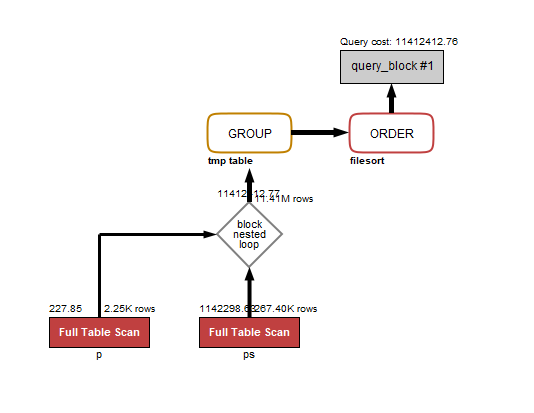


#### c. Crear las claves principales y foráneas mediante los ficheros script CrearClavesPrimarias.sql y CrearClavesForeaneas.sql, y nuevamente estudiar el pland e consulta, comparando costes con el punto anterior.

Primero creamos claves primarias y a continuación las foráneas, ya que el orden inverso no puede realizarse.

Mostramos ahora el plan de consulta con las claves creadas y su coste asociado.

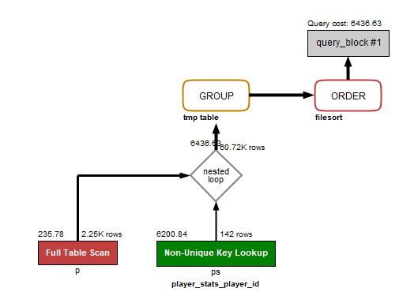
 
Realiza el mismo escaneo para la tabla de jugador (p) pero para la tabla de estadísticas (ps) el coste se ve reducido debido a la búsqueda de claves no únicas. Esto significa que ha usdao el índice player_id para buscar en esta tabla y esta vez las tablas escaneadas de esta parte son 142, las producidas por el join ahora son 60720 . Posteriormente realiza el group by y order by como en la consulta anterior solo que en este caso el coste final de la consulta estimado es de 6436.73. Por lo que es mucho más óptimo realizar esta consulta con claves primarias y foráneas.  

#### d. Crear los índices que se estimen necesarios para mejorar la consulta.

Creamos un índice para nacionalidad, ya que ésta se situa en la cláusula WHERE, por lo que la consulta es susceptible de mejorar con un índice, además se trata de una cadena de 3 caracteres por lo que no resultaría costoso.

El otro índice que creamos va para la triada firstName, lastName y edad situada en la cláusula GROUP BY, por lo que también es susceptible de mejora.

```SQL
CREATE INDEX indx_nation
ON player(nationality);

CREATE INDEX indx_name_age
ON player(firstName, lastName, edad);
```

#### e. Estudiar el plan de consulta con los nuevos índices y comparar resultados con los obtenidos en los puntos anteriores.

En este primer intento usamos exclusivamente el índice para la nacionalidad del jugador que es indx_nation. Se realiza el mismo plan de ejecución que en el apartado anterior pero con un coste inferior de 24691.02. Por lo que este índice es considerado por el planificador y es más optimo que no usarlo. 

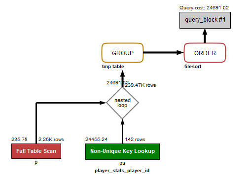
 
Ahora borramos el índice *indx_nation* y repetimos la consulta utilizando exclusivamente el índice indx_name_age.

Debido a que no tiene en consideración este índice, el resultado es el mismo que al no usar índices (ver apartado 2.c).

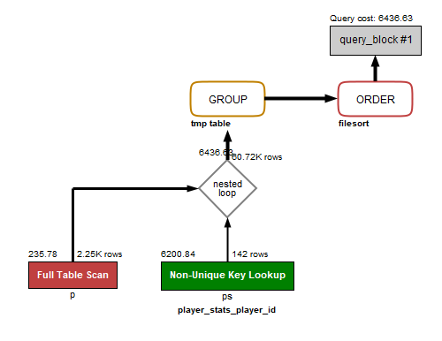

Vamos a realizar un último experimento en este apartado probando ambos índices por si pudiese mejorar el coste del planificador.

Como podemos observar en la imagen inferior, sigue sin tener en cuenta el indx_name_age y solo utiliza el indx_nation por lo que el resultado es el mismo que si solo utilizamos indx_nation.

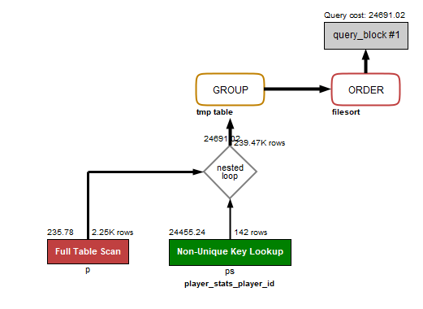

Por lo tanto la acción más optima en este caso para el planificador es utilizar exclusivamente el indx_nation para la nacionalidad del jugador en esta consulta.

### 3. Optimización de consultas y estudio de planes de consulta

#### a. Eliminar los índices creados en el apartado anterior, manteniendo claves primarias y foráneas.

```SQL
DROP INDEX indx_nation
ON player;

DROP INDEX indx_name_age
ON player;
```

#### b. Definir en SQL al menos dos sentencias diferentes que permitan obtener los datos de los equipos que hayan jugado más partidos en los últimos seis meses del año 2017, devolviendo los atributos: identificador del equipo, nombre del equipo, número de partidos jugados, total de tiros (tshots) realizados en esos seis meses, media de goles del equipo por partido.

La primera consulta que realizamos utiliza los valores de fechas absolutos y la segunda utiliza valores de fecha aplicando la función YEAR y MONTH.

```SQL
-- Primera consulta
USE segundapracticabda;
SET GLOBAL query_cache_type = 0;
SELECT t.team_id, teamName, SUM(tshots) AS tiros, AVG(tgoals) AS avg_gol_partido, count(*) AS numPartidos
FROM team t INNER JOIN team_stats ts ON t.team_id=ts.team_id 
INNER JOIN game g ON ts.game_id = g.game_id
WHERE date_time BETWEEN '2017-07-1' AND '2017-12-31'
GROUP BY t.team_id, teamName
HAVING numPartidos >= ALL(SELECT count(*) AS numPartidos
	FROM team t INNER JOIN team_stats ts ON t.team_id=ts.team_id 
    		    INNER JOIN game g ON ts.game_id=g.game_id
	WHERE date_time BETWEEN '2017-07-1' AND '2017-12-31'
	GROUP BY t.team_id);
```

El planificador utiliza las claves primarias para las tablas de team_stats (ts) y team (t) y realiza un escaneo completo de la tabla game (g). Posteriormente realiza en join de game con team_stats y el resultado con team. Por último le aplica la cláusula GROUP BY y resulta en un coste total de 4338.72 para esta consulta.

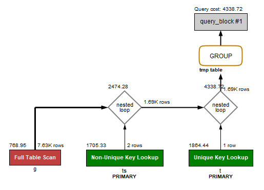

```SQL
-- Segunda consulta
USE segundapracticabda;
SET GLOBAL query_cache_type = 0;
SELECT t.team_id,teamName,SUM(tshots) AS tiros, AVG(tgoals) AS gol_partido, count(*) AS numPartidos
FROM team t INNER JOIN team_stats ts ON t.team_id=ts.team_id
INNER JOIN game g ON ts.game_id=g.game_id
WHERE YEAR(date_time)=2017 AND MONTH(date_time)>=7
GROUP BY t.team_id, teamName
HAVING numPartidos >= ALL(SELECT count(*) AS numPartidos
	FROM team t INNER JOIN team_stats ts ON t.team_id=ts.team_id
    		    INNER JOIN game g ON ts.game_id=g.game_id
	WHERE YEAR(date_time)=2017 AND MONTH(date_time)>=7
	GROUP BY t.team_id);
```

En este caso el planificador realiza ahora un escaneo completo de la tabla de equipo (t), y utiliza las claves como índice en las otras tablas. Además la tabla de partidos (g) se ve afectada en coste por las funciones utilizadas. En este caso el join se realiza primero entre team y team_stats y el resultado con la tabla de partidos (g). Posteriormente realiza el GROUP BY y el query_block resultante tiene como coste 9353.92, lo cual es más costoso que la consulta anterior.

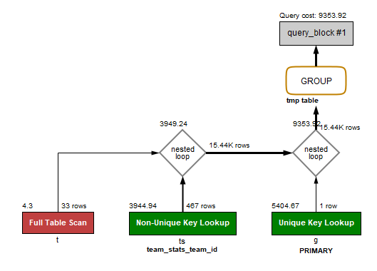


#### c. Crear los índices que permitan optimizar el coste de las consultas, analizando plan de consulta y coste para cada uno de los casos, justificando que solución es la más óptima.

En la primera consulta realizada en este apartado no usamos funciones para la fecha y se encuentra en la cláusula WHERE, por lo tanto es susceptible de mejora con índice.

En ambas consultas realizamos un GROUP BY por team_id y teamName, por lo que un índice para ambos valores es considerado en ambas para optimizar. 

```SQL
-- Creación de índices para la primera consulta
CREATE INDEX indx_dtime
ON game(date_time);
CREATE INDEX indx_team_id_name
ON team(team_id, teamName);
```
```SQL
-- Creación de índices para la segunda consulta
CREATE INDEX indx_team_id_name
ON team(team_id, teamName);
```

- Los resultados obtenidos en este apartado para las consultas realizadas indican una mejora sustancial en cuanto al uso de índices. Veamos:

- En cuanto a la primera consulta propuesta:

Empezamos utilizando solo el índice indx_dtime, podemos apreciar que efectivamente se usa el índice en la tabla de partidos (g) y se recude bastante el coste tanto del escaneo de esta tabla como de la consulta global que pasa a ser de 1846.02.

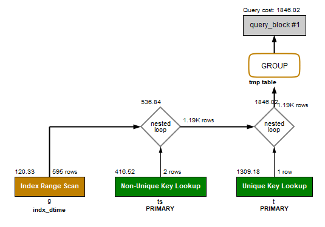
    
Ahora eliminamos el índice de indx_dtime y probamos a realizar la misma consulta con el índice indx_team_id_name.

No se produce ningún cambio respecto al plan sin la creación de este índice.

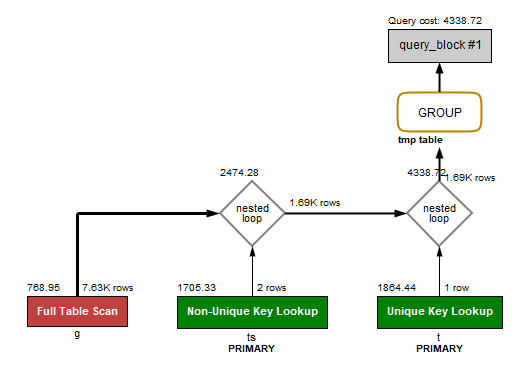

Probamos ahora a usar los dos índices en la primera consulta.

Como podemos observar se obtiene el mismo coste en la tabla game que al usar solo indx_dtime pero a la hora del join con team_stats el coste aumenta debido al uso del índice indx_team_id_name. El coste resultante es de 2626.96, que es superior al de la consulta A con el índice indx_dtime. Por lo tanto para esta consulta lo más óptimo considerado es usar exclusivamente el índice indx_dtime.
    
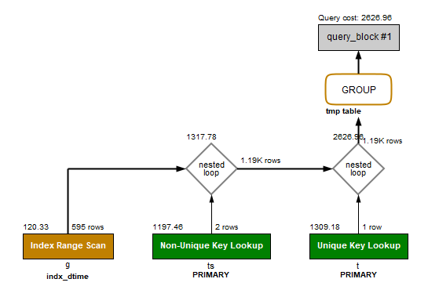
    
- En cuanto a la segunda consulta propuesta:

Como vemos, utiliza el índice en la tabla equipo (t) pero no reduce el coste final del query_block con respecto a la consulta sin índices. Sin embargo el peso de la consulta recae en examinar la tabla de equipo y quita peso al GROUP BY. Por eso el código de colores pinta ahora la cláusula GROUP BY en verde claro y la tabla team en rojo.

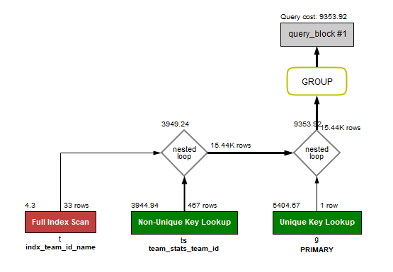
 
Como conclusión de este ejercicio, para realizar la consulta pedida de forma óptima, lo ideal es usar la primera consulta propuesta con el índice indx_dtime.

### 4. Estudio de índices en actualizaciones.

#### a. Eliminar los índices creados en el apartado anterior manteniendo claves primarias y foráneas.

```SQL
DROP INDEX indx_dtime
ON game;

DROP INDEX indx_team_id_name
ON team;
```

#### b. Crear un atributo en la tabla "player_stats" que se denomine "puntuación"que sea un número entero. El contenido de dicho atributo, para cada estadística de cada partido será un valor que se corresponderá con la suma de las cantidades de los atributos goals, shots y assists (es decir, en cada fila se sumarán los valores de estos atributos y se actualizará en el nuevo atributo "puntuación" con esa suma.) Actualizar la tabla player_stats para que contenga dicha información tomando nota de su tiempo de ejecución.

```SQL
USE segundapracticabda;
SET GLOBAL query_cache_type = 0;

-- Creación de la columna en la tabla stats
ALTER TABLE player_stats
ADD COLUMN puntuacion INT;

-- Update de la columna puntuación usando la función SUM
UPDATE player_stats
SET puntuacion = (SELECT SUM(assists+goals+shots)
				  GROUP BY game_id, player_id);
```

El coste de la actualización de este apartado es de 12.109 segundos.

#### c. Volver a actualizar a null el atributo puntuación en todas las filas.

```SQL
USE segundapracticabda;
SET GLOBAL query_cache_type = 0;
UPDATE player_stats
SET puntuacion = null;
```

El coste de la actualización a null es 9.860 segundos.

#### d. Por preverse un tipo de consultas con ordenación muy complicada, se desea crear un índice en la tabla "player_stats" por los atributos goals, shots, game_id, assists, player_id y puntuación, en ese orden. Crear el índice.

```SQL
CREATE INDEX indx_stats
ON player_stats(goals, shots, game_id, assists, player_id, puntuacion);
```

#### e. Volver a ejecutar la sentencia que establece los valores del atributo puntuación a la suma comentada anteriormente. Comprobar tiempo de ejecución y compararlo razonadamente con el contenido del punto 4.b.

Volvemos a ejecutar la actualización del apartado 4.b, pero en este caso el tiempo de ejecución pasa a ser 18.218 segundos, por lo tanto no es aconsejable el uso de este índice.

### 5. Desnormalización

#### a. Eliminar los índices creados en el apartado anterior, manteniendo claves primarias y foráneas.

```SQL
DROP INDEX indx_stats
ON player_stats;
```

#### b. Crear una consulta que devuelva, para cada jugador su nombre, apellido, edad, total de asistencias (assists) y media de asistencias por partido, total de goles (goals) y media por partido para aquellos jugadores que tengan una edad entre 25 y 33 años.

```SQL
USE segundapracticabda;
SET GLOBAL query_cache_type = 0;
SELECT firstName, lastName, edad, goles, media_goles, SUM(assists) AS asistencias, AVG(assists) AS media_asis
FROM player p INNER JOIN player_stats ps ON p.player_id = ps.player_id
WHERE edad BETWEEN '25' AND '33'
GROUP BY firstName, lastName, edad, goles, media_goles;
```

El planificador en este caso analiza completamente la tabla player (p) sin índices y la tabla player_stats (ps) con indices de clave. Posteriormente realiza el join de ambas resultando en 45278 filas y por último, pasa por la tabla temporal para el GROUP BY y el coste del query_block resultante es 37958.45.

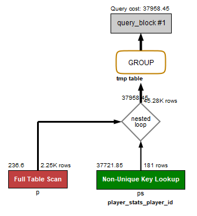

#### c. Aplicar la técnica de desnormalización que se considere más adecuada para acelerar la consulta del apartado 5.b, creando los scripts sql necesarios para modificar el esquema de la base de datos.

Para mejorar el coste de la consulta anterior vamos a aplicar la ténica de desnormalización en la tabla de jugadores. Para ello vamos a añadir a esta tabla las columnas de estadísticas de jugador correspondientes a asistencias y media de asistencias, ya que goles y media_goles ya pertenecen a la tabla de jugador. Si no hubiesen pertenecido goles y media_goles a esta tabla, entonces hubiésemos aplicado desnormalización también con esas columnas.


```SQL
USE segundapracticabda;
SET GLOBAL query_cache_type = 0;

ALTER TABLE player
ADD COLUMN asistencias INT,
ADD COLUMN media_asistencias FLOAT;
```

#### d. Crear un script que actualice los datos implicados en la desnormalización.
```SQL
USE segundapracticabda;
SET GLOBAL query_cache_type = 0;
UPDATE player p 
SET asistencias = (
	SELECT SUM(assists) 
    FROM player_stats ps 
    WHERE p.player_id = ps.player_id 
    GROUP BY ps.player_id),
	media_asistencias = (
	SELECT AVG(assists)
        FROM player_stats ps 
		WHERE p.player_id = ps.player_id 
		GROUP BY ps.player_id);
	
```

#### e. Crear los triggers necesarios para mantener actualizados los datos implicados en la desnormalización.

```SQL
USE segundapracticabda;
SET GLOBAL query_cache_type = 0;

create trigger update_asistencias after update
on player_stats for each row
update player
set asistencias=asistencias+new.assists-old.assists,
 media_asistencias=(select avg(assists) from player_stats where player_id=new.player_id  group by player_id)
 where player.player_id=new.player_id;


create trigger update2_asistencias after insert
on player_stats for each row 
update player 
set asistencias=asistencias+new.assists,
 media_asistencias=(select avg(assists) from player_stats where player_id=new.player_id  group by player_id)
where player_id=new.player_id ;


create trigger update3_asistencias after delete
on player_stats for each row
update player
set asistencias=asistencias-old.assists ,
 media_asistencias=(select avg(assists) from player_stats where player_id=old.player_id  group by player_id)
where player.player_id=old.player_id;


```

Pruebas asociadas para el correcto funcionamiento de los triggers en ejercicio_5_PRUEBAS_TRIGGERS.sql cuyo contenido incluye:

```SQL
SELECT * FROM player;

-- Comprobación UPDATE
UPDATE player_stats
SET assists = 8 
WHERE game_id=2012020011 AND player_id=8448208;

-- Deshacer UPDATE
UPDATE player_stats
SET assists = 2
WHERE game_id=2012020011 AND player_id=8448208;

-- Comprobación INSERT
INSERT INTO player_stats(game_id,player_id,assists)
VALUES (2012020001, 8448208, 188);

-- Comprobación DELETE
DELETE FROM player_stats WHERE game_id = 2012020001 AND player_id = 8448208 AND assists = 188;
```


#### f. Realizar la consulta 5.b sobre la base de datos desnormalizada. Estudiar coste y plan comparándolo con el obtenido en el apartado 5b.

```SQL
-- Consulta tabla desnormalizada
USE segundapracticabda;
SET GLOBAL query_cache_type = 0;

SELECT firstName, lastName, edad, goles, media_goles, asistencias, media_asistencias
FROM player p
WHERE edad BETWEEN '25' AND '33'
GROUP BY firstName, lastName, edad, goles, media_goles;
```

El planificador escanea la tabla de jugador completa y posteriormente realiza el GROUP BY, el coste resultante es de 229.24 lo cual supone una mejora en el coste de 3 ordenes de magnitud. Por lo tanto desnormalizar la tabla en este caso, es muy eficiente para el planificador.

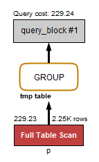

### 6. Particionamiento.

#### a. Eliminar las claves foráneas con el script proporcionado “EliminarClavesForaneas.sql”.

En este apartado ejecutamos el script pertinente, sin más comentarios.

#### b. Crear una consulta sql que obtenga, para cada jugador, su apellido, nombre, el número de partidos jugados y el número de jugadas realizadas por el jugador durante el año 2017. Estudiar coste y plan.

```SQL
-- Consulta del punto 6.b
USE segundapracticabda;
SET GLOBAL query_cache_type = 0;

SELECT p.firstName, p.lastName, COUNT(ps.player_id) AS partidosJugados, SUM(ps.puntuacion) as jugadasRealizadas
FROM player p, player_stats ps , game g
WHERE p.player_id = ps.player_id 
AND g.game_id = ps.game_id
AND YEAR(g.date_time) =2017
GROUP BY p.player_id;
```

Primero realiza un escaneo completo de la tabla game (g) a la cual hace join con player_stats (ps). Al resultado se le hace join con player (p) donde se usan como índice las claves primarias (al igual que en player_stats). Por último se le aplica el group by y el resultado del query_block es 173779.07.

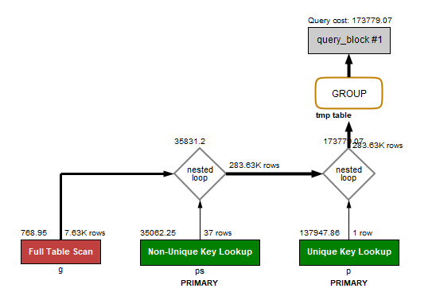

#### c. Razonar justificadamente (sin necesidad de implementarla realmente en SQL) una variante de la estructura existente realizando un particionamiento horizontal de los datos con el objeto de mejorar el tipo de consultas (con diferentes años) que se ha realizado en el apartado 6.a

Como hemos visto en las clases de laboratorio de la asignatura, un particionamiento horizontal puede ser muy útil si solo se van a acceder a datos en un determinado rango. Puede suponer pasar de hacer consultas de varios millones de filas a consultas de medio millón o incluso resultar útil para ciertas proyecciones.

Por lo siguiente, nuestra propuesta consiste en hacer un particionamiento horizontal por años donde tendríamos tantas tablas como años para nuestro esquema. Esto supondría una mejora sustancial ya que, especialmente en un sistema de gestión de base de datos de un club deportivo, interesaría especialmente hacer consultas frecuentes (o inserciones y actualizaciones) en la temporada actual.

#### d. Implementar en MySQL un particionamiento horizontal (mediante la sentencia ALTER TABLE …. PARTITION ….) que separe los datos de los partidos jugados en el año 2017 del resto. Realizar de nuevo la consulta 6.a y estudiar coste y plan comparándolo con lo obtenido en el apartado 6.a. Si se necesita modificar la clave primaria, hágase mediante la sentencia ALTER TABLE.

Sigue la lógica anteriormente comentada, en este caso vamos a tener una tabla con los datos correspondientes a un solo año y por otro lado otras dos tablas con el resto de años. Para los anteriores a 2017 y los posteriores.

Resulta que no podemos realizar particionamientos con MySQL en tablas que tengan claves foráneas, por lo que hay que ejecutar el script del punto 6.a (requisito ya cumplido) además tampoco podemos usar claves primarias. Eliminar esta clave sería una mala solución por lo que utilizamos una superclave conformada por game_id y date_time. De forma que podamos acceder a todas las tablas particionadas con clave.

```SQL
-- Particionamiento horizontal
ALTER TABLE game DROP PRIMARY KEY;

ALTER TABLE game ADD PRIMARY KEY(game_id, date_time);

ALTER TABLE game 
PARTITION BY LIST (YEAR(date_time)) (
	PARTITION part_2017 VALUES IN (2017),
    PARTITION part_resto VALUES IN (2013, 2014, 2015, 2016),
    PARTITION part_2018 VALUES IN (2018)
);
```

Realizamos ahora de nuevo la consulta 6.b, especificando su partición, y observamos las diferencias.
```SQL
-- Consulta del punto 6.d
USE segundapracticabda;
SET GLOBAL query_cache_type = 0;

SELECT p.firstName, p.lastName, COUNT(ps.player_id) AS partidosJugados, SUM(ps.puntuacion) as jugadasRealizadas
FROM player p, player_stats ps , game PARTITION(part_2017)
WHERE p.player_id = ps.player_id 
AND game.game_id = ps.game_id
GROUP BY p.player_id;

```

Como vemos hace un escaneo completo de la partición de game (g) que es part_2017, el resto del plan es el mimso que sin partición. Sin embargo el coste es de 31097.86. Por lo tanto al realizar la partición la consulta sufre una mejora considerable.

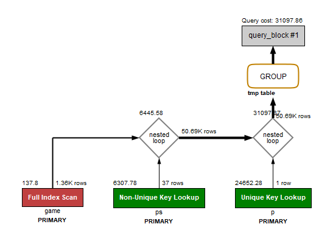


## 3. Conclusiones

La realización de la práctica nos ha puesto al día con lo explicado en la parte teórica de la asignatura correspondiente a índices y optimización de consultas en bases de datos relacionales. 

Ha sido especialmente interesante el disponer de métricas de coste para las consultas, como prueba empírica de que se están realizando optimizaciones reales.

Como en un principio no hemos usado los planes de consulta gráficos de MySQL al usar MariaDB, hemos acabado enfrentándonos a la interpretación tabular de los planes de consulta. Sin embargo y por el bien de nuestra mejor comprensión, repetimos nuestra práctica en el mismo equipo utilizando MySQL para obtener el plan de consultas gráfico el cual hemos acabado reflejado en esta memoria.


