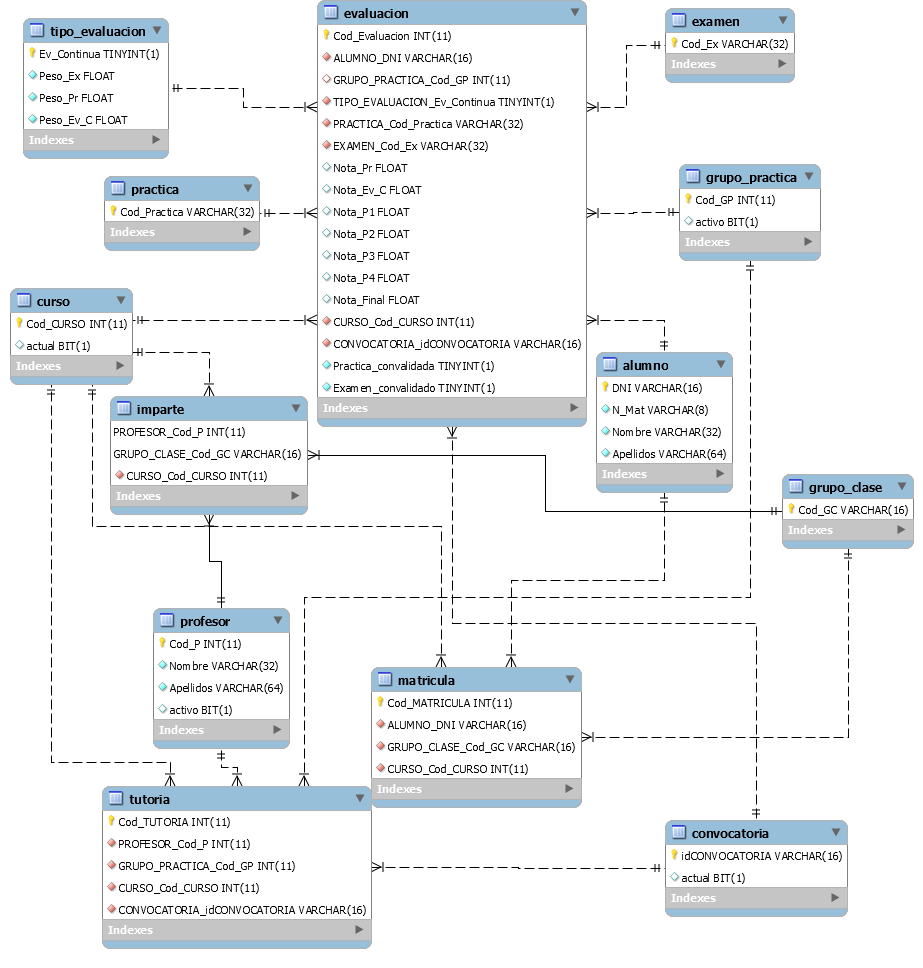

---
title: "Documento de análisis y diseño"
author: [Luis Mata Aguilar - bm0613]
date: "26-05-2019"
subtitle: "Práctica final EM - UPM"
logo: logo.png
titlepage: "True"
toc: "True"
listings-no-page-break: "True"
lof : "true"
...

# Historial de revisiones                                                         
Fecha | Versión | Descripción | Autor
------|---------|-------------|------
02-05-2019 | 1.0 | Borrador inicial | Luis Mata
23-05-2019 | 1.1 | Diagramas E/R y clases | Luis Mata
26-05-2019 | 1.2 | Completo | Luis Mata

# 1. Introducción

Este documento describe el diseño de la aplicación, el cual va a ser actualizado durante la realización del proyecto. Se incluye una sección de bases y objetivos para clarificar el dominio del problema así como un diseño arquitectónico, las tecnologías usadas y el diseño de software, tanto frontend como backend.

## 1.1 Propósito de este documento

El propósito de este documento consiste en exponer las decisiones de diseño pertinentes que han sido tomadas por el equipo de reingeniería durante la realización del proyecto que ha sido desarrollado para la práctica final de la asignatura de EM correspondiente al tercer curso de Ingeniería de Software de la Universidad Politécnica de Madrid, España.

## 1.2 Organización del documento

El documento presente está organizado como sigue:

* Sección 1, Introducción, describe los contenidos de esta guía, documentación usada durante el proceso de análisis, etc.

* Sección 2, Entorno y objetivos, visión general del proyecto así como una descripción a alto nivel de sus funcionalidades principales.

* Sección 3, Estructura a alto nivel del sistema

* Sección 4, Arquitectura del sistema

* Sección 5, Métricas

## 1.3 Público objetivo

Este documento está pensado para que desarrolladores y otros stakeholders puedan entender y seguir la estructura de trabajo realizada durante el proceso de desarrollo, especialmente para reconocer la documentación y arquitectura del sistema legado que se nos presenta. Se contempla que la aplicación pueda mutar en el tiempo para soportar nuevas funcionalidades, pero este documento contempla exclusivamente el diseño y análisis de la aplicación legada. Así tanto los stakeholders pertinentes como desarrolladores podrán seguir el progreso y tomar decisiones informadas.

## 1.4 Alcance

Este documento concierne el diseño de la aplicación legada EUI Notes, con una perspectiva académica y didáctica con el principal objetivo de saber realizar un análisis y diseño de sistemas legados. Proporcina una descripción de la estructura y la arquitectura del sistema en general y las decisiones tomadas.

# 2. Entorno y objetivos

## 2.1 Entorno

El propósito de este proyecto es desarrollar un sistema que permita la gestión de tutorías, grupos de alumnos y notas de alumnos por profesores y que los alumnos puedan consultar sus notas e historial de calificaciones de ciertas asignaturas, tal y como se especifica en el documento de requistos.

Para ello el sitema consta de los siguientes elementos. Una aplicación de escritorio desarrollada en Java, instalada en cada ordenador de usuario (profesores, alumnos y administradores), una base de datos con tecnología relacional (MySQL), un gestor para la base de datos (MySQLWorkbench). Parece en principio que la aplicación se conecta a la base de datos local que hospede cada equipo (información localizada en el archivo config.txt) , por lo que no se dispone de un servidor. Respecto a éste último punto puede suceder que la intención es tener una copia local de la base de datos en cada equipo final. El objetivo sin embargo del proceso de reingeniería es transformar la aplicación en un servicio web, creado para el stack completo.

## 2.2 Descripción a alto nivel de las funcionalidades

Se intenta construir un sistema flexible y seguro que permita a los alumnos consultar sus notas, a profesores gestionar sus grupos de alumnos y, para gestionar usuarios, existirá un rol de administrador que los gestione. 
Entre las funcionalidades incluyen las siguientes:

- Gestionar alumnos de asignaturas; dar de alta, de baja, modificar o consultar listado de alumnos.
- Gestionar profesores de asignaturas; dara de alta, de baja, modificar o consultar listado de profesores.
- Gestionar grupos de prácticas de asignaturas; incluyendo las opicones anteriores.
- Gestionar calificaciones; tanto modificar como consultar las calificaciones.
- Gestionar las tutorías de los profesores.
- Gestionar las convocatorias de cada alumno.
- Consultar historial de alumnos de una asignatura.

# 3. Estructura a alto nivel del sistema

## 3.1. Infraestructura de comunicación

Como vemos la aplicación original está pensada para ejecutarse en un entorno de escritorio donde los datos quedan registrados localmente. El archivo de configuración para la comunicación con la base de datos se encuentra en un txt en el código suministrado. En principio funciona exclusivamente en local aunque arquitecturas de comunicación más complicadas se pueden considerar.

{height=20%}

# 4. Arquitectura del sistema

## 4.1 Modelo de datos

Para obtener este artefacto hemos usado MySQLWorkbench con la funcionalidad de ingenieria inversa. Como podemos apreciar, se pueden ver optimizaciones posibles en la capa de datos como reagrupar examen-convocatoria-evaluación en una entidad.

## 4.2 Modelo lógico

Una vez realizada la ingeniería inversa a la capa de datos de la aplicación, pasamos a la capa lógica para una caval compresión de las funcionalidades originales. Hemos usado como herramienta StarUML con el plugin de reverse-engineering para Java. Esta herramienta no realiza perfectamente el diagrama, por lo que hemos tenido que retocarlo a mano después de su generación, para que resulte representativo del modelo lógico original.

## 4.3 Diagramas de secuencia

Con la intención de profundizar en el funcionamiento de la aplicación heredada, se ha realizado un diagrama de secuencias de alguna funcionalidad que se ha considerado más complicada.

Para realizar estos diagramas hemos usado CallGraph Viewer, que es un plugin para el IDE Eclipse. Con esta herramienta hemos podido trazar tanto diagramas de secuencia como grafo de dependecias de algunos métodos.

### 4.3.1 Grafo de llamadas main

Si extraemos los métodos que se llaman en la clase principal del programa obtenemos lo siguiente, con profundidad 1 para todos los métodos menos para getFramePrincipal, que lo hemos desarrollado para ofrecer una aclaración sobre como se inicia la aplicación.

### 4.3.2 Grafo de llamadas main.iniciar

El método para iniciar el programa dentro del programa principal, es iniciar(). Como podemos ver recupera de la base de datos las entidades que luego encapsula en clases lógicas. En última instancia se trata de obtener el DataAccessObject que se encargará de establecer la conexión con la base de datos.

### 4.3.3 Diagrama de secuencia: Actualizar notas de la convocatoria anterior

A continuación se muestra el diagrama de secuencia generado para el método actualizarNotasConvocatoriaAnterior de la clase Evaluacion. Para que las dimensiones de este diagrama no sean excesivamente grandes, hemos colapsado los bloques try-catch de las excepciones, los cuales retornaban RuntimeException en todas las ocasiones que aparecen.

Podemos apreciar interacciones interesantes con las capas de Java como los StringBuilders que preparan las consultas para el controlador de evaluaciones. Se trata de un método de actualización a la basede datos, veamos:

### 4.3.4 Diagrama de secuencia: Recuperar último código de tutorías

En este caso nos encontramos con el método de la clase Tutoria que se encarga de obtener el último código de tutorías usado. Lo encontramos ilustrativo debido a que usa otro tipo de excepciones que tienen que ver con la gestión de bases de datos SQL (SQLException), lo cual se maneja internamente con un rollback en caso de darse.

Por lo demás se trata de un método de consulta a la base de datos, veamos.

# 5. Métricas

En este apartado vamos a habalr de las métricas que hemos usado para medir el desempeño de este programa. Se ha utilizado principalmente la herramienta vista en clase de BetterCodeHub, el cual ofrece una cobertura de 10 dimensiones de calidad para el código.

Esta herramienta nos otorga una puntuación de 4 puntos sobre 10. En algunos puntos no ofrece explicación pero vamos a hablar de las que nos han resultado más relevantes.

## 5.1 Código duplicado

El programa posee numerosas duplicaciones de código a lo largo de casi todas las clases. El caso más excesivo son las 122 lineas de JDialogMenuSeleccionarBBDD. Esto es una práctica poco recomendable para una aplicación que quiera ser mantenible.

## 5.2 Cobertura de tests

Una de las prácticas más recomendables es tener la mayoría del código sometido a pruebas unitarias, en nuestro caso, no existe ninguna prueba.

## 5.3 Asuntos diferentes en módulos diferentes

Vamos a ver la dependencia de llamadas de algunas clases del programa, se recomienda que el fan-in de las clases no supere más de 10 llamadas para mantener funcionalidades separadas en clases separadas.

## 5.4 Fan-in

