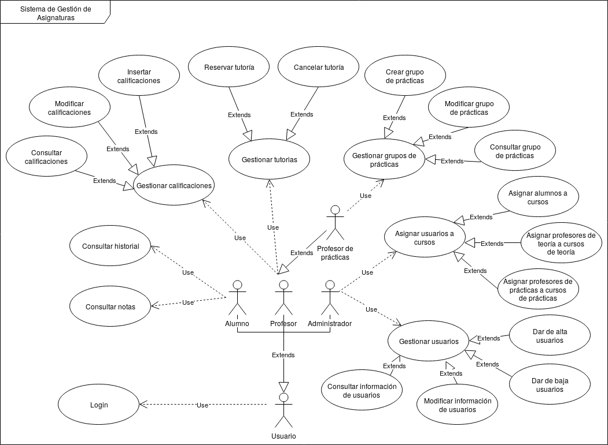

---
title: "Documento de especificación de requisitos"
author: [Grupo 9]
date: "2-05-2019"
subtitle: "Práctica final EM - UPM"
logo: logo.png
titlepage: "True"
toc: "True"
listings-no-page-break: "True"
lof : "true"
...

# Historial de revisiones

Fecha | Versión | Descripción | Autor
------|---------|-------------|------
2-05-2019 | 1.0 | Borrador inicial | Luis Mata
10-05-2019 | 1.1 | Todas las secciones añadidas | Luis Mata
15-05-2019 | 1.2 | Incluidos requisitos extraidos de Edgar | Luis Mata
19-05-2019 | 1.3 | Historias de usuario y diagrama de CU añadido. Documento final. | Luis Mata
# 1. Introducción

## 1.1 Propósito del documento

El propósito de este documento es especificar los requisitos del proyecto ambos funcionales y no funcionales. Se realiza en el ámbito academico para la práctica final de la asignatura de Evolución y Mantenimiento de la titulación de Ingeniería de Software impartida en la ETSISI, de la UPM.

## 1.2 Organización del documento

El presente documento está organizado como sigue:

- Sección 1: Introducción, se describen los contenidos de esta guia, la documentación usada durante el proceso de desarrollo, así como el alcance del documento y las definiciones de abreviaciones y acrónimos.

- Sección 2: Bases y objetivo, donde se describen las bases del problema así como los objetivos del proyecto.

- Sección 3: Requisitos, describe los requisitos del proyecto, funcionales y no funcionales.

- Sección 4: Historias de Usuario, contiene las historias de usuario usadas para describir la funcionalidad del sistema.

## 1.3 Público objetivo

- Equipo
- Supervisores (se trata de los profesores de la asignatura)
- Patrocinadores (no aplica por ser un documento académico)

El propósito de este documento es clarificar y proveer consenso en los requisitos del proyecto entre los propios miembros del equipo así como con los supervisores del mismo que serán los profesores de la asignatura. Es un objetivo principal de comunicación y especificación de tareas que se pretenden realizar en la forma de funcionalidades representadas en historias de usuario. Asímismo este documento se podrá usar para verificar que el proyecto cumple con los requisitos planteados.

## 1.4 Alcance 

En este documento se provee la siguiente información: 
- Bases del problema a resolver, información sobre el entorno del proyecto a un nivel alto de abstracción.
- Requistos funcionales y no funcionales, incluyendo digramas UML y casos de uso para los requisitos funcionales.
- Historias de usuario que examinan cada caso de uso en detalle.

## 1.5 Definiciones y acrónimos

### 1.5.1 Definiciones

Concepto | Definición
---------|-----------
 uno | dos

### 1.5.2 Acrónimos y abreviaciones

Acrónimo o abreviación | Definición
-----------------------|-----------
UML | Unified Modeling Language
UPM | Universidad Politécnica de Madrid
ETSISI | Escuela Técnica Superior de Ingeniería de Sistemas Informáticos

# 2. Bases y objetivo

## 2.1 Antecedentes

La ETSISI becó hace varios años a dos estudiantes para la elaboración de software para dar soporte a la gestión de la información académica de asignaturas de la escuela. Se desarrolló una aplicación Java para gestionar una determinada asignatura de acuerdo a los requisitos y necesidades de los profesores en aquel momento.

La aplicación se estuvo operando y utilizando durante varios años, mientras los desarrolladores daban soporte de ayuda al usuario (help desk) y de mantenimiento. Sin embargo, cuando los desarrolladores terminaron su beca, la aplicación cayó en desuso debido a sus restricciones tecnológicas.

Las profesoras de la asignatura de EMS, conscientes de la necesidad de consulta de datos de asignatura desde plataformas móviles con Android o IOS como OS, nos han pedido en primer lugar realizar un proceso de reingeniería de la aplicación original y una migración a tecnologías .NET.

En este documento se recogen los requisitos extraídos del proceso de reingeniería así como las modificaciones planteadas para la migración tecnológica.

## 2.2 Descripción a alto nivel del proyecto

El objetivo de este sistema es crear una aplicación móvil que permita al usuario hacer lo siguiente:

1. A los alumnos les permitirá consultar sus calificaciones en el curso actual y otros años. 
2. La aplicación permitirá a los profesores gestionar calificaciones, grupos de prácticas de alumnos y horarios de tutoría.
3. La aplicación permitirá al administrador del sistema gestionar usuarios y asignar usuarios a cursos, tanto profesores como alumnos.

En general la interfaz de usuario se presupone intuitiva y user friendly, especialmente importante en un ambiente académico de accesibilidad para todos.

# 3. Requisitos

En esta sección se provee la información detallada de los requisitos funcionales y no funcionales.

## 3.1 Requisitos funcionales

ID | Caso de uso | Descripción
---|-------------|------------
RF1 | Consultar notas | El sistema permitirá al alumno consultar sus calificaciones en el curso actual.
RF2 | Consultar historial | El sistema permitirá al alumno consultar su historial de calificaciones de cualquier curso académico.
RF3 | Gestionar calificaciones | El sistema permitirá a los profesores gestionar las calificaciones de sus alumnos.
RF3.1 | - | Insertar nuevas calificaciones.
RF3.2 | - | Modificar calificaciones.
RF3.3 | - | Consultar calificaciones.
RF4 | Gestionar grupos de prácticas | El sistema permitirá a los profesores gestionar los grupos de prácticas
RF4.1 | - | Crear un nuevo grupo de prácticas.
RF4.2 | - | Modificar un grupo de prácticas.
RF4.3 | - | Consultar un grupo de prácticas.
RF5 | Gestionar tutorías | El sistema permitirá a los profesores gestionar sus tutorías.
RF5.1 | - | Reservar tutoría.
RF5.2 | - | Cancelar tutoría.
RF6 | Gestionar usuarios | El sistema permitirá al administrador gestionar los usuarios de la aplicación.
RF6.1 | - | Dar de alta usuarios.
RF6.2 | - | Dar de baja usuarios.
RF6.3 | - | Modificación de la información de los usuarios.
RF6.4 | - | Consultar la información de los usuarios.
RF7 | Asignar usuarios a cursos | El sistema debe permitir al administrador asignar usuarios a cursos
RF7.1 | - | Asignar alumnos a cursos.
**RF7.2** | - | Asignar profesores de teoría a cursos de teoría.
**RF7.3** [^1] | - | Asignar profesores de prácticas a cursos de prácticas.
RF8 | Login | Todos los usuarios de la aplicación podrán conectarse al sistema conforme a su rol de forma remota.

[^1]: RF7.2 y RF7.3 referentes a los nuevos requisitos dados por Edgar.
\endgroup

# 4. Historias de usuario

SID | UID | Historia | Prioridad 
----|-----|----------|----------
 US1 | RF8 | Como usuario quiero poder hacer login en la aplicación con mi rol si estoy conectado a internet(o intranet). | Alta.
 US2 | RF1 | Como alumno quiero poder consultar mis calificaciones del curso actual. | Alta. 
 US3 | RF2 | Como alumno quiero poder consultar mi historial de calificaciones de cualquier curso académico. | Media
 US4 | RF3.1 | Como profesor quiero poder insertar nuevas calificaciones a mis alumnos. | Media. 
 US5 | RF3.2 | Como profesor quiero poder modificar las calificaciones de mis alumnos cuando ya las he insertado previamente al menos una vez. | Media.
 US6 | REF3.3 | Como profesor quiero poder consultar las calificaciones de mis alumnos. | Alta.
 US7 | REF4.1 | Como profesor de prácticas quiero poder crear un nuevo grupo de prácticas. | Media.
 US8 | REF4.2 | Como profesor de prácticas quiero poder modificar un grupo de prácticas existente. | Media.
 US9 | REF4.3 | Como profesor de prácticas quiero poder consultar un grupo de prácticas existente. | Alta.
 US10 | REF5.1 | Como profesor quiero poder reservar un horario para mis tutorías y que quede reflejado en el sistema. | Media.
 US11 | REF5.2 | Como profesor quiero poder cancelar una tutoría establecida previamente y que quede reflejado en el sistema. Media.
 US12 | REF6.1 | Como administrador del sistema quiero poder dar de alta usuarios en el sistema. | Alta.
 US13 | REF6.2 | Como administrador del sistema quiero poder dar de baja a usuarios en el sistema. | Alta.
 US14 | REF6.3 | Como administrador del sistema quiero poder modificar la información de los usuarios registrados en el sistema. | Media.
 US15 | REF6.4 | Como administrador del sistema quiero poder consultar la información de los usuarios registrados en el sistema. | Alta.
 US16 | REF7.1 | Como administrador del sistema quiero poder asignar alumnos a cursos. | Media.
 US17 | REF7.2 | Como administrador del sistema quiero poder asignar profesores de teoría a grupos de teoría | Media.
 US18 | REF7.3 | Como administrador del sistema quiero poder asignar profesores de prácticas a grupos de prácticas. | Media.

## 4.1 Historias de usuario detalladas

**ID** | **Descripción exten.** | **Fuente** | **Criterio de validación**
-------| -------------|------------|---------------------------
 US1  | Cuando un usuario inicie el cliente, se podrá conectar al sistema. El sistema reconocerá el rol del usuario y se mostrarán sus opciones. | Equipo de desarrollo | - Introducción correcta de credenciales garantiza el acceso. Introducción errónea vuelve a pantalla de login. Se accede al home del usuario después del acceso.
 US2  | Cuando un alumno acceda a la aplicación podrá seleccionar la opción de consultar calificaciones para ver sus notas del curso actual. | Equipo de desarrollo | Correcta secuencia de acciones llevan a la pantalla de calificaicones del alumno. Se muestran sus notas actualizadas. Es susceptible a los cambios de profesores y administrador.
 US3  | Cuando un alumno acceda a la aplicación podrá seleccionar la opción de consultar sus calificaciones de cualquier curso académico para ver sus calificaciones por curso y año. | Equipo de desarrollo | Correcta secuencia de acciones llevan a la pantalla de calificaciones por curso del alumno. Se muestra la información actualizada.
 US4  | Cuando un profesor acceda a la aplicación podrá seleccionar la opción de insertar calificaciones. Podrá insertar las notas de los alumnos de sus cursos de forma individual. | Equipo de desarrollo | Una vez modificada la información se muestra actualizada en la base de datos.
 US5  | Cuando un profesor acceda a la aplicación podrá seleccionar la opción de modificar calificaciones. Podra cambiar las notas de los alumnos de sus cursos de forma individual. | Equipo de desarrollo | Una vez modificadas las calificaciones, persisten en la bases de datos.
 US6  | Cuando un profesor acceda a la aplicación podrá seleccionar la opción de consultar las calificaciones de sus alumnos. Se mostrarán para cada grupo de alumnos las calificaciones por alumno o en una lista. | Equipo de desarrollo | Se muestran correctamente los datos solicitados.
 US7  | Cuando un profesor de prácticas acceda a la aplicación podrá seleccionar la opción de crear un nuevo grupo de prácticas para así crear uno nuevo tras asignarle un nombre. | Equipo de desarrollo | Se verá reflejado en la base de datos una nueva tabla de grupo de prácticas.
 US8  | Cuando un profesor de prácticas acceda a la aplicación podrá seleccionar la opción de modificar un grupo de prácticas para modificar las propiedades de un grupo de prácticas existente. | Equipo de desarrollo | Se reflejan los datos modificados en la base de datos del sistema.
 US9  | Cuando un profesor de prácticas acceda a la aplicación podrá seleccionar la opción de consultar un grupo de prácticas para así ver las propiedades de dicho grupo. | Equipo de desarrollo | Se muestran los datos solicitados correctamente.
 US10 | Cuando el profesor acceda a la aplicación podrá seleccionar la opción de tutorías para gestionar tutorias. Una vez en esta sección podrá reservar un horario para sus tutorías y que quede reflejado en el sistema. | Equipo de desarrollo | El sistema reserva correctamente su horario y se puede comprobar (US11).
 US11 | Cuando el profesor acceda a la aplicación podrá seleccionar la opción de tutorias para gestionar sus tutorías. Una vez en esta sección podrá seleccionar una de sus reservas de tutorías y cancelarla. | Equipo de desarrollo | La reserva de tutoría queda cancelada y se refleja en la bases de datos.
 US12 | Cuando el administrador acceda a la aplicación, podrá seleccionar la opción de dar de alta a un usuario para darlo de alta en el sistema y que pueda identificarse. | Equipo de desarrollo | El usuario registrado puede acceder al sistema.
 US13 |  Cuando el administrador acceda a la aplicación, podrá seleccionar la opción de dar de baja a un usuario para darlo de baja en el sistema y que ya no pueda identificarse. | Equipo de desarrollo | El usuario dado de baja ya no puede acceder al sistema.
 US14 | Cuando el administrador acceda a la aplicación, podrá seleccionar la opción de modificar usuaraio para modificar la información de los usuarios registrados en el sistema. Una vez en esta sección podrá modificar la información de los ususuarios. | Equipo de desarrollo | Los cambios quedan reflejados en la base de datos.
 US15 | Cuando el administrador acceda a la aplicación, podrá seleccionar la opción de consultar usuario para consultar la información de los usuarios registrados en el sistema. Una vez en esta sección podrá consultar la información de los usuarios. | Equipo de desarrollo | Se muestran correctamente todos los usuarios del sistema. Los usuarios están actualizados.
 US16 | Cuando el administrador acceda a la aplicación, podrá seleccionar la opción de gestionar usuarios donde podrá asignar alumnos a cursos.| Equipo de desarrollo | Cambios correctamente reflejados en la base de datos.
 US17 | Cuando el administrador acceda a la aplicación, podrá seleccionar la opción de gestionar usuarios donde podrá asignar profesores de teoría a grupos de teoría. | Edgar | Cambios correctamente reflejados en la base de datos.
 US18 | Cuando el administrador acceda a la aplicación, podrá seleccionar la opción de gestionar usuarios donde podrá asignar profesores de prácticas a grupos de práticas. | Edgar | Cambios correctamente reflejados en la base de datos.
